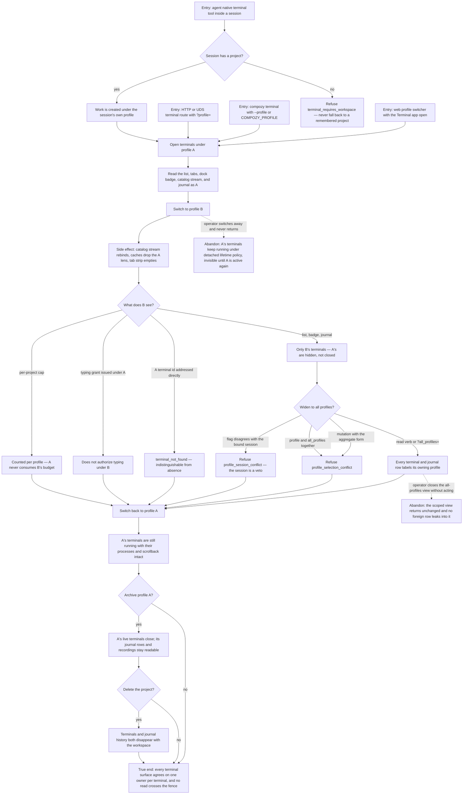

# J-switch-profile-terminal-scope — Switch the hat I work as and watch every terminal surface re-scope

An operator opens terminals under one profile, switches to another, confirms that every terminal
surface — list, tabs, dock badge, catalog stream, journal, attach path, input requests — shows only
the new profile's work, then switches back and finds the original terminals still running. Agents
working inside a session inherit that same fence and are refused, never guessed at, when they have no
project at all.



```yaml
journey:
  id: J-switch-profile-terminal-scope
  name: "Switch the hat I work as and watch every terminal surface re-scope"
  value_statement: "Switching profile never mixes another context's terminals into my window, and the work I left behind is still there when I switch back."
  personas: [Ada, Dora, Bruno]
  entry_points:
    - url: "Web profile switcher with the Terminal app, tab strip, and dock badge open"
      origin: in-app-nav
    - url: "CLI: compozy terminal list|journal|input-requests with --profile and --all-profiles; get|attach|quote with --profile only; open|exec|kill|signal|respond|record refusing the aggregate form"
      origin: direct
    - url: "HTTP and UDS terminal routes with ?profile= and ?all_profiles=, plus the catalog stream"
      origin: direct
    - url: "Native terminal tools inside a managed session, including a session with no project"
      origin: agent
  actions:
    - step: 1
      verb: "Open terminals under one profile"
      expected_observable: "Each terminal records the acting profile at creation and that ownership never changes afterwards."
    - step: 2
      verb: "Switch profile with the Terminal app open"
      expected_observable: "List, tab strip, dock badge, catalog stream, and journal re-scope immediately; the previous profile's terminals disappear from view without being closed."
    - step: 3
      verb: "Address the hidden terminal by id and try its grant"
      expected_observable: "The id reads as not found with no hint of another owner, and a typing grant from the other profile does not authorize typing here."
    - step: 4
      verb: "Widen to the all-profiles read and try the refused selector shapes"
      expected_observable: "Every aggregate row labels its owner; a mutation with the aggregate form, both selectors together, and a flag that disagrees with the bound session are each refused with their own code."
    - step: 5
      verb: "Run a terminal surface from a session with no project"
      expected_observable: "Creation and execution are refused with the no-project reason instead of landing in a remembered project."
    - step: 6
      verb: "Switch back, then archive the profile and delete the project"
      expected_observable: "The original terminals are still running; archiving closes them while its history stays readable; deleting the project removes terminals and history together."
  goal:
    observable: "One terminal has exactly one owning profile, every read surface honours that owner, and every widening or conflict is explicit rather than silent."
    side_effects: [terminal-owner-stamped, catalog-stream-rebound, query-cache-renamespaced, archived-profile-terminals-closed, journal-history-retained]
  true_end_state: "After switching back and reloading, the first profile's terminals are still running with their scrollback, the second profile's list never contained them, and the journal attributes every command to the profile it ran under."
  exit:
    natural: "The operator resumes work in the profile whose terminals are the only ones on screen."
  abandonment:
    - at_step: 2
      how: "Switch profile and leave without returning."
      resume: "The hidden terminals keep running under detached lifetime policy; switching back re-attaches them from the current stream cursor."
    - at_step: 4
      how: "Close the all-profiles read without acting on any row."
      resume: "The scoped view returns unchanged; no aggregate row is cached into it."
  crosses: [J-scope-work-by-profile, J-operate-integrated-terminal, J-audit-terminal-work, profile-resolver, terminal-registry, catalog-SSE, typing-grants, input-requests, admission-caps, journal]
```
