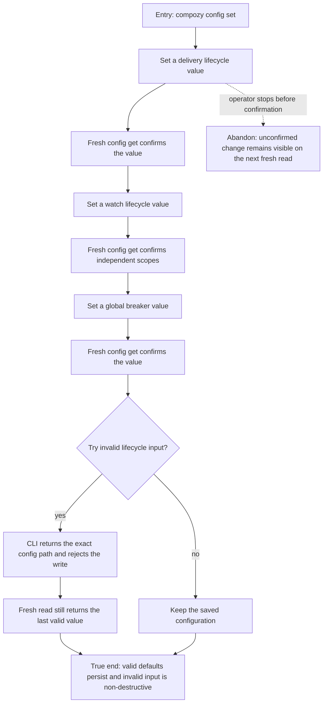

# J-tune-loop-lifecycle-defaults — Tune Loop lifecycle defaults safely

An autonomous operator changes the global delivery and watch lifecycle defaults through the
structured CLI, confirms the saved value through a fresh read, and recovers from invalid input
without losing the last valid configuration.



```yaml
journey:
  id: J-tune-loop-lifecycle-defaults
  name: "Tune Loop lifecycle defaults safely"
  value_statement: "An autonomous operator can tune delivery, watch, and breaker lifecycle policy through structured configuration without corrupting the last valid state."
  personas: [Ada]
  entry_points:
    - url: "CLI: compozy config set"
      origin: direct
  actions:
    - step: 1
      verb: "Set one delivery retry value and read it back"
      expected_observable: "Structured output names the accepted path and a fresh read returns the saved value"
    - step: 2
      verb: "Set an independent watch value and a global breaker value"
      expected_observable: "Each scope retains its own value and the breaker remains global"
    - step: 3
      verb: "Try an invalid duration or attempt bound"
      expected_observable: "The CLI rejects the exact path and a fresh read preserves the prior valid value"
  goal:
    observable: "Delivery, watch, and breaker values round-trip through public structured commands"
    side_effects: [config-overlay-updated]
  true_end_state: "A fresh CLI read confirms the valid values after an invalid write attempt, with no partial mutation."
  exit:
    natural: "The operator can start future Loops with the reviewed lifecycle policy."
  abandonment:
    - at_step: 1
      how: "The operator closes the terminal before reading the value back."
      resume: "The next fresh config read reveals the durable value without requiring session state."
  crosses: [CLI, config-lifecycle, delivery-defaults, watch-defaults, global-breaker]
```

Coverage taxonomy: the charter covers the full value journey, structured round-trip mechanics,
error recovery, and an adjacent Loop-config canary. Browser, viewport, and accessibility checks
are deliberately skipped because this change exposes no Web surface.
