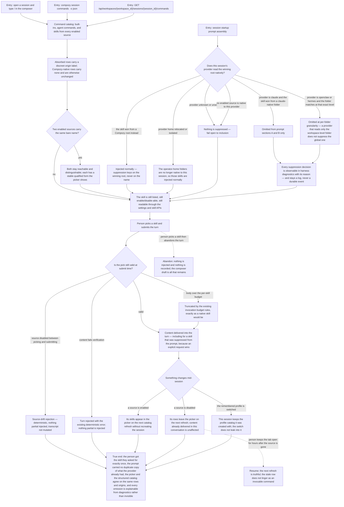

# J-use-absorbed-skills-in-a-session — Use an absorbed skill in a conversation without paying for it twice

Someone opens a session and types `/`. Skills absorbed from another tool's folder are in the list
next to Compozy's own, each carrying a small label saying where it came from. If the session's
provider already reads that folder itself, CompozyOS quietly stops re-sending the same text into the
prompt — but the skill stays listed, stays selectable, and still arrives in full when the person asks
for it by name.



```yaml
journey:
  id: J-use-absorbed-skills-in-a-session
  name: "Use an absorbed skill in a conversation without paying for it twice"
  value_statement: "Skills from any enabled folder are usable in a session exactly like Compozy's own, and the prompt never carries a second copy of what the provider already reads for itself."
  personas: [Théo, Bruno, Ada]
  entry_points:
    - url: "Web: session composer / picker"
      origin: in-app-nav
    - url: "Session: startup prompt assembly and per-turn prompt input"
      origin: direct
    - url: "CLI: compozy session commands <session-id> -o json"
      origin: direct
    - url: "HTTP and UDS: GET /api/workspaces/{workspace_id}/sessions/{session_id}/commands"
      origin: direct
    - url: "Diagnostics: harness suppression diagnostics (skills.injection.suppressed log records)"
      origin: direct
  actions:
    - step: 1
      verb: "Type / in a session that has skills from several sources"
      expected_observable: "Absorbed skills appear beside native ones, each foreign row carrying a discreet origin label and native rows carrying none."
    - step: 2
      verb: "Start sessions under each supported provider and its aliases"
      expected_observable: "Only skills whose winning root that provider already reads natively are omitted from the prompt, at per-folder granularity, and an unknown provider suppresses nothing."
    - step: 3
      verb: "Ask why a skill is not in the prompt"
      expected_observable: "Harness diagnostics name the skill, its source, the provider, and the reason — the omission is explainable, not invisible."
    - step: 4
      verb: "Explicitly invoke a skill that was suppressed from the prompt"
      expected_observable: "Its content is delivered into the turn in full; the explicit request wins over the suppression."
    - step: 5
      verb: "Invoke two same-named skills from different roots through their qualified forms"
      expected_observable: "Each qualified form reaches its own physical skill deterministically, and the form stays stable for a given configuration generation."
    - step: 6
      verb: "Switch the remembered profile, then disable a source between picking a skill and submitting"
      expected_observable: "The existing session keeps its original profile catalog, and the stale pick is rejected as source drift with nothing partial injected and no transcript mutation."
  goal:
    observable: "The person invokes any absorbed skill as easily as a native one, and the prompt contains each skill's text at most once."
    side_effects: [prompt-sections-a-and-b-filtered, skills-injection-suppressed-log-record, session-command-revision-broadcast, skill-invocation-recorded-in-transcript]
  true_end_state: "The requested skill arrived exactly once, the prompt carried no duplicate of what the provider already reads, the web picker and the structured command catalog list the same rows with the same origins and the same revision, and every omission is traceable in diagnostics."
  exit:
    natural: "The conversation continues with the skill's content in play and no wasted context."
  abandonment:
    - at_step: 4
      how: "The person picks a skill from the menu and then abandons the turn without submitting."
      resume: "Nothing is injected and nothing is recorded; only the composer draft remains."
    - at_step: 6
      how: "The person leaves the tab open for hours after an operator disables the source."
      resume: "The next catalog refresh is truthful; the stale row does not linger as an invocable command, and content already delivered earlier in the conversation is untouched."
  crosses: [J-absorb-skills-from-other-tools, J-use-session-slash-commands, J-load-skill-in-managed-session, session-harness, injection-policy, command-catalog-projection, provider-env-and-home, Web composer, CLI, HTTP, UDS]
```
