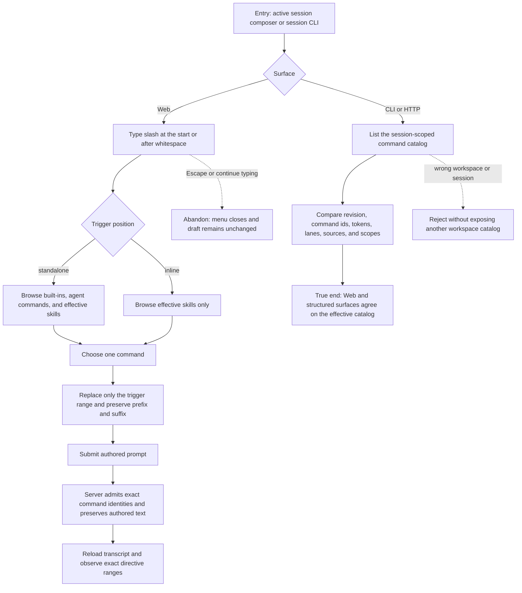

# J-use-session-slash-commands — Discover and use session commands without losing the prompt

The operator discovers only commands that are effective for the current session, inserts a command
at the cursor without losing surrounding text, and can inspect the same catalog through public
structured surfaces. Standalone controls remain available only where they are valid; skills remain
usable after whitespace anywhere in the prompt.



```yaml
journey:
  id: J-use-session-slash-commands
  name: "Discover and use session commands without losing the prompt"
  value_statement: "I can discover the commands that actually apply to this session, insert one wherever I am writing, and trust that no surrounding text or source identity is lost."
  personas: [Théo, Bruno]
  entry_points:
    - url: "web session composer"
      origin: in-app-nav
    - url: "CLI: compozy session commands <session-id> -o json"
      origin: direct
    - url: "HTTP: GET /api/workspaces/{workspace_id}/sessions/{session_id}/commands"
      origin: direct
  actions:
    - step: 1
      verb: "Open the command menu at the start and in the middle of a draft"
      expected_observable: "A standalone trigger offers built-ins, agent commands, and effective skills; an inline trigger offers effective skills only."
    - step: 2
      verb: "Choose a command with text before and after the trigger"
      expected_observable: "Only the active slash query is replaced; prefix, suffix, spacing, cursor continuity, and authored text remain intact."
    - step: 3
      verb: "Submit and reload the authored prompt"
      expected_observable: "The server preserves the exact authored text, admits only verified command identities, injects skill content into the effective prompt, and projects exact directive ranges after reload."
    - step: 4
      verb: "Read the same catalog from CLI and HTTP"
      expected_observable: "Public structured surfaces agree on the session revision and path-free command projection, while a wrong workspace is fenced."
  goal:
    observable: "The operator can use a session-effective slash command without losing text, and every public catalog read describes the same command identities."
    side_effects: [prompt-command-identities-admitted, skill-content-injected, transcript-directives-projected]
  true_end_state: "After a cold reload, the authored prompt is unchanged, admitted directives mark only their exact ranges, and Web, CLI, and HTTP still expose the same effective command catalog for that session."
  exit:
    natural: "The operator continues the same conversation with the command result and transcript intact."
  abandonment:
    - at_step: 1
      how: "The operator presses Escape or continues writing instead of choosing a command."
      resume: "The menu closes without altering the draft; typing slash again opens a fresh query at the current cursor."
    - at_step: 4
      how: "The caller uses a different workspace id with the same session id."
      resume: "The request returns not found and exposes no catalog; retrying with the owner workspace succeeds."
  crosses: [assistant-ui-composer, session-command-catalog, skill-registry, prompt-admission, transcript, SSE, HTTP, UDS, CLI, native-tools]

coverage:
  journeys: "The Web insertion path and structured catalog path reach the same session-scoped catalog."
  functional: "Exact trigger replacement, authored-text preservation, revision parity, and workspace fencing are in scope."
  experiential: "Feature Tour checks discoverability, keyboard operation, focus, and quiet visual hierarchy."
  edge_error_empty: "Escape, no matching commands, repeated slash queries, Unicode prefix text, refresh, and wrong-workspace reads are in scope."
  cross_cutting: "Desktop and narrow viewport captures plus the exact-text composer canary cover responsiveness and regression; a live Codex native-CLI turn proves the selected skill reaches the provider while preserving authored history."
```
