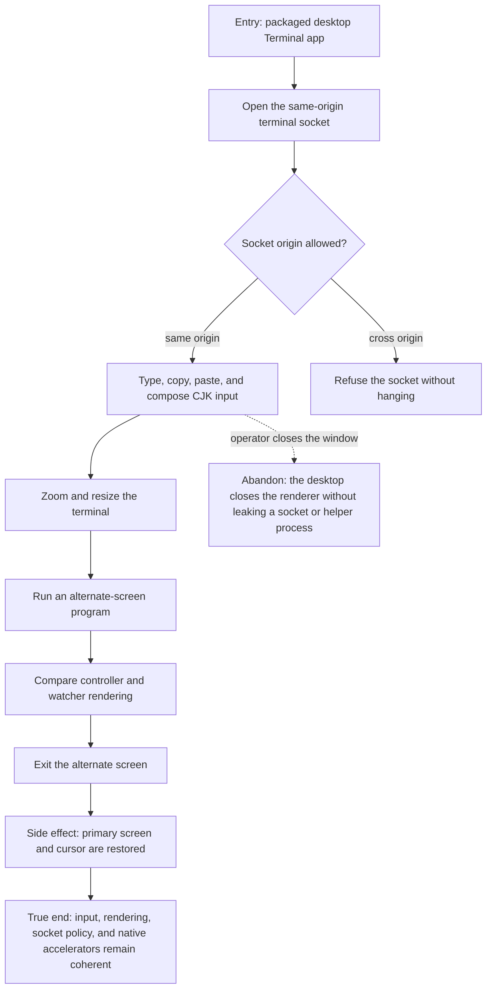

# J-use-terminal-desktop — Use a native-feeling terminal in the packaged desktop

An operator uses the packaged desktop terminal with native editing, international input, zoom, and
resize behavior while the shell keeps its same-origin network boundary.



```yaml
journey:
  id: J-use-terminal-desktop
  name: "Use a native-feeling terminal in the packaged desktop"
  value_statement: "I can use the terminal in the desktop app with the same input and rendering fidelity I expect from a native terminal, without widening its network access."
  personas: [Marina]
  entry_points:
    - url: "Packaged desktop Terminal app, native Edit menu, and zoom controls"
      origin: in-app-nav
  actions:
    - step: 1
      verb: "Open the desktop terminal"
      expected_observable: "The same-origin socket attaches and a cross-origin probe is refused within a bounded time."
    - step: 2
      verb: "Type, compose, copy, and paste"
      expected_observable: "Native accelerators and CJK composition deliver exactly one intended input sequence."
    - step: 3
      verb: "Zoom, resize, and run an alternate-screen program"
      expected_observable: "Controller and watcher reflow to the same screen without stale cells."
    - step: 4
      verb: "Exit the alternate screen"
      expected_observable: "The primary screen, cursor, and scrollback return intact."
  goal:
    observable: "The packaged desktop preserves terminal input and screen fidelity under its intended socket policy."
    side_effects: [socket-attached, terminal-resized, alternate-screen-entered-and-restored]
  true_end_state: "After alternate-screen exit and a final resize, controller and watcher display the same restored primary screen and no disallowed socket remains open."
  exit:
    natural: "The operator continues in the restored primary shell or closes the terminal window."
  abandonment:
    - at_step: 2
      how: "Close the desktop window during composition or paste."
      resume: "Reopen the app; no partial input is replayed and a fresh socket is attached."
  crosses: [desktop-shell, CSP, WebSocket, xterm-renderer, clipboard, IME, zoom]
```
