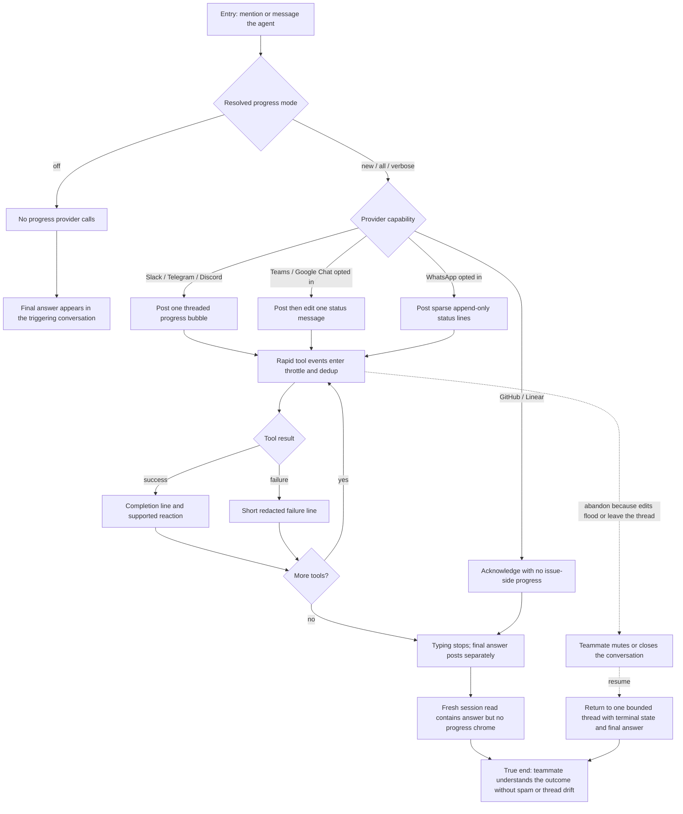

# J-watch-agent-work-channel — Watch the agent work without channel noise

A teammate triggers a tool-heavy turn and follows one bounded, readable status lifecycle to a final
answer in the same conversation. The journey covers default-on editable providers, opted-in
lower-tier providers, append-only WhatsApp, mode-off silence, and issue-provider no-op progress.



```yaml
journey:
id: J-watch-agent-work-channel
  name: "Watch the agent work without channel noise"
  value_statement: "I can tell that the agent is working and what finished without being flooded or leaving the conversation that started the work."
  personas: [Maya, Omar]
  entry_points:
    - url: "Slack, Telegram, Discord, Teams, Google Chat, or WhatsApp bridge conversation"
      origin: external-share
    - url: "GitHub issue/review comment or Linear comment/Agent Session"
      origin: external-share
  actions:
    - step: 1
      verb: "Trigger a turn that runs several repeated and distinct tools"
      expected_observable: "The first supported progress surface appears in the triggering conversation, or mode off remains silent"
    - step: 2
      verb: "Watch rapid starts, completions, and one failure"
      expected_observable: "Updates are throttled, identical consecutive lines collapse, and the terminal state is never dropped"
    - step: 3
      verb: "Let the final answer settle"
      expected_observable: "Typing and mutable progress stop; the final answer remains a distinct message in the correct thread"
    - step: 4
      verb: "Open the corresponding session transcript"
      expected_observable: "Only agent/session events are present; channel progress chrome is absent"
  goal:
    observable: "The final answer and terminal tool outcome are understandable at the intended target with no secret, duplicate terminal, or cross-thread update."
    side_effects: [progress-posted-or-nooped, progress-edited-or-appended, typing-cleared, final-answer-delivered]
  true_end_state: "After the turn and a fresh transcript read, the channel has bounded presentation state, the final answer is in the right conversation, and transcript history is pure."
  exit:
    natural: "The teammate reads the answer and continues the same conversation."
  abandonment:
    - at_step: 2
      how: "The teammate mutes or leaves because status updates appear too frequently or in the wrong thread."
      resume: "Returning after the turn shows a bounded terminal status and one final answer rather than an unbounded edit storm."
  crosses: [acp-events, canonical-redaction, ordered-delivery, provider-rate-limits, provider-formatters, channel-threading, session-transcript]
```

Automated backbone: `_tests.md` E2E runtime 6.1–6.3 plus provider fake-API suites. Task 10 owns
the observable spam, routing, and transcript-purity walk.
