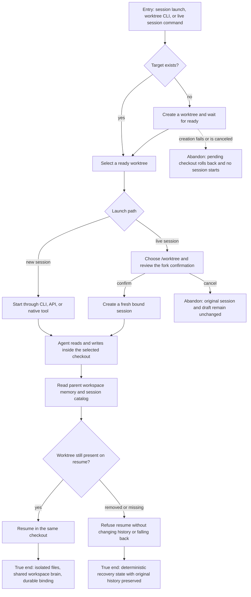

# J-worktree-management — Isolate agent work in a Git worktree

An operator creates or selects a worktree, starts a session inside it, and trusts Compozy to keep
file access inside that checkout while preserving the parent workspace's memory and history.



```yaml
journey:
  id: J-worktree-management
  name: "Isolate agent work in a Git worktree"
  value_statement: "I can run agents in separate Git checkouts without losing workspace memory, leaking files across checkouts, or silently returning to the workspace root."
  personas: [Bruno, Ada, Théo]
  entry_points:
    - url: "CLI: compozy worktree ...; compozy session new --worktree|--new-worktree"
      origin: direct
    - url: "HTTP or UDS: workspace worktree and session endpoints"
      origin: direct
    - url: "Web: live session composer /worktree command"
      origin: in-app-nav
  actions:
    - step: 1
      verb: "Create or select a ready worktree"
      expected_observable: "The selected checkout has one stable identity, path, branch, and ready state; pending and failed materialization remain visible and never start a session."
    - step: 2
      verb: "Start a new session there or fork a live session after confirmation"
      expected_observable: "A fresh session records the worktree binding, while the origin session remains unchanged and a canceled confirmation creates nothing."
    - step: 3
      verb: "Read and change files during agent work"
      expected_observable: "The ACP process and local tools use the worktree root, reject paths outside it, and do not expose sibling checkout changes."
    - step: 4
      verb: "Recall workspace memory and inspect session state"
      expected_observable: "Root and worktree sessions share the parent workspace brain, and every structured surface returns the same workspace and worktree identities."
    - step: 5
      verb: "Resume after the checkout remains ready or disappears"
      expected_observable: "A ready checkout resumes in place; a missing checkout returns a deterministic refusal, preserves history, and never falls back to the workspace root."
  goal:
    observable: "Agent work remains filesystem-isolated in the chosen checkout while memory, history, and management stay anchored to the parent workspace."
    side_effects: [worktree-created, session-bound, session-history-persisted, workspace-memory-shared]
  true_end_state: "Fresh session and catalog reads retain the exact worktree binding; a normal resume returns to that checkout, while an out-of-band removal produces a recoverable refusal with the original session history unchanged."
  exit:
    natural: "The operator continues isolated work, forks another session, or removes the checkout after all bound sessions stop."
  abandonment:
    - at_step: 1
      how: "Worktree creation fails or the operator cancels while it is pending."
      resume: "The partial checkout and registry row roll back; retrying starts from a clean create flow and no session exists."
    - at_step: 2
      how: "The operator cancels the live-session fork confirmation."
      resume: "The original session and uncommitted files remain untouched; invoking /worktree again starts a new confirmation."
    - at_step: 5
      how: "Git removes the checkout outside Compozy before resume."
      resume: "Compozy preserves the session history, reports the missing binding, and lets the operator choose an explicit recovery path without root fallback."
  crosses: [Git, worktree-registry, session-runtime, sandbox, local-tool-host, memory, CLI, HTTP, UDS, native-tools, command-catalog]

coverage:
  journeys: "Creation, bound launch, live-session fork, isolated work, memory recall, and resume reach truthful terminal states."
  functional: "Binding persistence, root containment, list filtering, spawn inheritance, shared memory, and deterministic missing/refusal codes are in scope."
  experiential: "Pending progress, confirmation consequences, and recovery errors must remain clear without exposing implementation terms."
  edge_error_empty: "No worktrees, failed or canceled creation, missing checkout, removal racing a new binding, and canceled fork confirmation are in scope."
  cross_cutting: "CLI, HTTP, UDS, native-tool, and command-catalog parity plus workspace isolation cover adjacent management surfaces."
```
