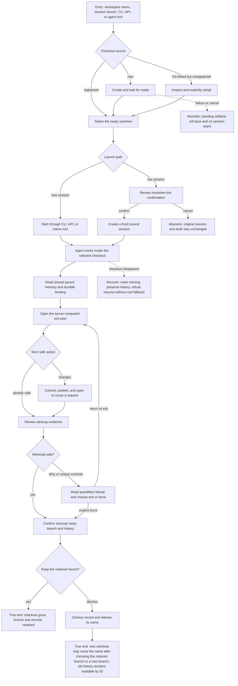

# J-worktree-management — Isolate agent work in a Git worktree

An operator creates or adopts a worktree, works inside it, leaves through the assisted-exit ladder,
and removes the checkout without losing its branch, parent-workspace memory, or execution history.



```yaml
journey:
  id: J-worktree-management
  name: "Complete isolated work without losing its history"
  value_statement: "I can create or adopt an isolated checkout, work and leave safely, then remove it without losing its branch, workspace memory, or execution history."
  personas: [Bruno, Ada, Théo]
  entry_points:
    - url: "CLI: compozy worktree ...; compozy session new --worktree|--new-worktree"
      origin: direct
    - url: "HTTP or UDS: workspace worktree and session endpoints"
      origin: direct
    - url: "Native tools: compozy__worktree_* and compozy__session_create"
      origin: agent
    - url: "Web: workspace menus, overview, session environment, or /worktree"
      origin: in-app-nav
  actions:
    - step: 1
      verb: "Create, adopt, or select a ready worktree"
      expected_observable: "One stable runtime identity names the checkout; creation shows pending progress, adoption proves linked-worktree identity without changing the directory, and neither path mints duplicates on retry."
    - step: 2
      verb: "Start a new session there or fork a live session after confirmation"
      expected_observable: "A fresh session records the worktree binding, while the origin session remains unchanged and a canceled confirmation creates nothing."
    - step: 3
      verb: "Read and change files during agent work"
      expected_observable: "The ACP process and local tools use the worktree root, reject paths outside it, and do not expose sibling checkout changes."
    - step: 4
      verb: "Recall workspace memory and inspect the binding"
      expected_observable: "Root and worktree sessions share the parent workspace brain, and every structured surface returns the same workspace and worktree identities."
    - step: 5
      verb: "Follow the assisted-exit plan"
      expected_observable: "The server-computed ladder pauses on unknown or unsafe state, shows the complete commit scope, publishes once, and either opens or reuses a request without hiding a zero-credential browser path."
    - step: 6
      verb: "Remove the checkout through the safety boundary"
      expected_observable: "Clean removal confirms once; dirty or unique work refuses with quantified risk before a distinct force decision; the branch, session history, task history, and events remain readable."
    - step: 7
      verb: "Resume, recover, or dismiss after the checkout remains ready, is removed, or disappears"
      expected_observable: "A ready checkout resumes in place; removed or missing state never falls back to root or cascades history; restoration accepts only the recorded Git identity; dismissal releases the name while the old record stays readable by ID."
  goal:
    observable: "The isolated work reaches a safe exit and removal state while every durable record stays anchored to the parent workspace."
    side_effects: [worktree-created-or-adopted, session-bound, changes-published, checkout-removed, branch-preserved, history-persisted]
  true_end_state: "The checkout is safely removed or intentionally retained, its branch and durable records remain inspectable by ID, a dismissed name can be reused after choosing the retained branch or a new branch, and no resume, stream, cache, or agent surface can escape the original workspace and worktree boundary."
  exit:
    natural: "The operator removes the checkout after exit evidence is safe, or keeps it with a truthful blocker and a clear next action."
  abandonment:
    - at_step: 1
      how: "Worktree creation fails or the operator cancels while it is pending."
      resume: "The partial checkout and registry row roll back; retrying starts from a clean create flow and no session exists."
    - at_step: 2
      how: "The operator cancels the live-session fork confirmation."
      resume: "The original session and uncommitted files remain untouched; invoking /worktree again starts a new confirmation."
    - at_step: 5
      how: "The exit operation is interrupted, lacks credentials, or reports unreadable status."
      resume: "Durable progress states where it stopped; the operator retries, cancels the exact operation, or follows the sanitized browser path without losing completed steps."
    - at_step: 6
      how: "Dirty files, unique commits, a running session, or a hook denial blocks removal."
      resume: "The worktree returns to ready, the refusal preserves its evidence, and the operator resolves the blocker or enters a separate force confirmation."
    - at_step: 7
      how: "Git removes the checkout outside Compozy before resume."
      resume: "Compozy preserves the session history, reports the missing binding, and lets the operator choose an explicit recovery path without root fallback."
  crosses: [Git, worktree-registry, session-runtime, sandbox, local-tool-host, memory, CLI, HTTP, UDS, native-tools, command-catalog]

coverage:
  journeys: "Creation or adoption, bound launch or fork, isolated work, assisted exit, removal, and missing recovery all reach truthful terminal states."
  functional: "Identity validation, containment, exit fencing, branch preservation, non-cascading tombstones, replay, and deterministic refusals are in scope."
  experiential: "Pending progress, fork consequences, exit choices, quantified removal risk, and recovery actions must remain clear without exposing implementation terms."
  edge_error_empty: "No worktrees, failed or canceled creation, rejected adoption, status failure, interrupted exit, dirty removal, missing checkout, and canceled fork are in scope."
  cross_cutting: "CLI, HTTP, UDS, native tools, web S1-S16, hooks, Forge, config, streams, and workspace isolation qualify the same lifecycle."
```
