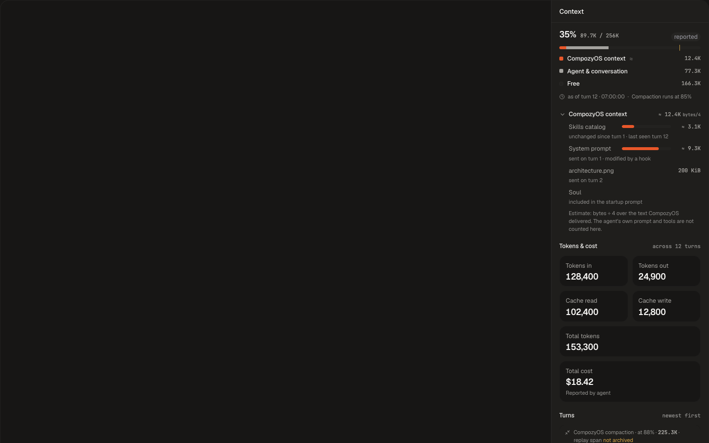

# Session context QA — September 12, 2026

Runtime and visual QA: pass after repair. This report records feature behavior; the enclosing delivery records the final local gate and exact-head PR CI separately.

## Environment and scope

Isolated feature lab: `/Users/pedronauck/dev/qa-labs/compozy-session-context-20260912-061018-100880-lab/qa-artifacts/qa/bootstrap-manifest.json`. API `http://127.0.0.1:55455`. Browser: browser-use onboarding, then agent-browser after CDP timeouts. Deterministic ACP fixtures own scripted context/cache states; OpenCode with Google Gemini 2.5 Flash owns live cost and image-delivery evidence. Operator credentials remained with the provider process.

## Journey matrix

| Charter / scenario | State | Evidence |
| --- | --- | --- |
| Context CLI / HTTP / UDS parity | Pass | Lab `qa/fixed-reported-*`, `fixed-turns-*`; CLI default UDS equals HTTP JSON |
| First lazy-bind delivery ownership | Pass after repair | `task06-logical-startup-integration-recheck.log`; fresh session `sess-6a2a3ac33f41f516` retains full startup owners |
| Text and binary attachment receipts | Pass | `text-attachment-confirmed.json`: text 83 delivered bytes, 21 estimated tokens; `binary-attachment-confirmed.json`: image 206471 bytes, no invented tokens |
| Live provider cost / cache provenance | Pass with explicit limitation | `final-google-usage.json`, `binary-attachment-confirmed.json`: three successful turns, actual agent-reported USD cost; provider omitted cache counters |
| Compaction marker and archived span | Pass | `compaction-turns.json` captures pending marker with span_archived false; `compaction-turns-settled.json` confirms true after summarizer commits archive |
| Real assembler / skills / hook / stopped integration | Pass | `.cache/session-context/task06-logical-startup-integration-recheck.log`, real ACP subprocess/SQLite, 12.637s |
| Composer / sidebar / openers / stopped Web readback | Pass | Full inline context, both openers, stale text receipt, stopped unknown-with-rows, Vault leave/return and retained open preference; live screenshots in `.cache/session-context/` |
| Adjacent Vault / health / inspect | Pass | Focused browser E2E includes a session secret in Vault; public health/inspect and stopped readback captured |
| Task03 VC01–09 / task04 VC10–11 | Pass | 44/44 pairs inspected and canonical validator PASS; `.compozy/tasks/session-context/evidence/visual/README.md` and `validation.log` |
| Lab teardown | Pass | `qa/teardown.json`: clean true; owned agent-browser also closed |
| Strict evidence audit | Delivery-owned | Lab `qa/verification-report.md` and strict audit output retain the final gate-linked verdict |

## Additional runtime evidence

- `disabled-threshold-usage.json`: after the publicly required daemon restart, threshold0 removes `pressure_threshold`; Web tooltip omits compaction eligibility. `used-only-context.json` and Web show 89.7K used without a denominator or bar.
- `unknown-correct-context.json`: an actual non-reporting ACP agent retains five delivery owners with unknown usage. Stopped-session Web readback preserves the list and a delivery-only turn.
- `usage-stream.sse`: three named `session_usage_changed` events (usage, prompt_delivery, done), none carrying an SSE id. Existing stream suites own push/poll/reconnect fencing.
- `stopped-http-usage.json`.usage equals `stopped-uds-usage.txt`; `public-health.txt` and `public-inspect.txt` remain available.
- `.cache/session-context/task06-web-e2e.log`: two focused daemon-served Playwright cases passed in17.8s after root Turbo build. Turbo has no E2E task, so the existing raw runner follows Mage's established ownership. Root Turbo remains the owner for frontend build/test/typecheck.
- The last internal receipt refactor uses AgentEvent's existing optional payload and preserves canonical wire JSON. Real daemon integration reran successfully in6.267s (`task06-final-receipt-integration.log`).

## Findings and limits

[BUG-20260912-context-delivery-details](../bugs/BUG-20260912-context-delivery-details.md) reproduced missing live receipt forwarding and startup ownership on CreateAccepted. Production repairs pass the existing daemon integration and fresh public replay. Final commit pending.

Fable 5.1 High completed exactly two source-review rounds: round 1 FIX_REQUIRED, round 2 PASS. Requested fixes and bounded visual follow-ups are implemented; no further review round or deep-review invocation.

OpenCode trials using Vertex, OpenAI OAuth and Groq failed for credential/model availability; Google API succeeded. No cache counters were emitted by the live provider, so these remain unreported; fixture counters are labeled separately. ACP Mock rejects image attachments because it does not advertise image capability; the supported live provider accepted the same image and produced a binary receipt.

The bootstrap's generic feature topology defaults were reconciled to the approved task05 charters: network channels and task lifecycle are out of scope. Original contract is retained as `scenario-contract.bootstrap.json`; four actual agent roles, live provider, cross-surface identity, artifact reuse and disruption evidence remain required. This is a feature QA verdict, not a release-scenario claim.

## Visual disposition

All eleven required contracts and thirty-three supplemental states pass the scoped component comparison. Named differences retain canonical packages/ui internals, runtime fixture content, illustrative host placement and the F9 ring-token disposition. References were unchanged; the capture server resolved the archived sibling stylesheet to its exact source asset. This is not a claim of full-frame pixel parity.

The live lab and the subsequent bounded capture leg were shut down through the manifest teardown command and retained clean:true. Final local gate and exact-head CI remain separate delivery obligations. The initial gate found oversized AgentEvent copies and small lint issues; repairs preserve lint policy and assertions. Go lint reports zero issues. Root Turbo lint/typecheck/test passed with 765 shared UI tests and 7,304 Web tests; final gate records cover the frozen delivery tree.

Final runtime-image inspection exposed [opaque turn ID overflow](../bugs/BUG-20260912-context-turn-identifiers.md), absent from the numeric examples. The bounded column now truncates long identifiers while preserving full identity access and complete three-digit numeric labels. The real ID shape has its own VC08 story and capture. Four affected pairs were re-captured; the complete validator passes 44/44, root Turbo typecheck passes, and the second teardown is clean.

The final CI product-language check required the current name CompozyOS in UI, CLI and documentation. COPY.md and the glossary own this naming disposition over the older board labels. The affected component captures were refreshed with the longer name; runtime calculations and public identifiers are unchanged.

## Design-parity refresh (later on 2026-09-12)

After this pass the composer control and the Context rail were brought to the named boards in `docs/design/opendesign/session-context/`: the retained F9 ring disposition, the visible percent label, the default `Empty` scale, and the canvas-soft tiles are replaced by the boards' ring-only trigger, compact empties, canvas tiles and turn card, legend/line grammar, and drawer header parity. The owning unit suites, `@compozy/ui` primitive suites, and the focused browser E2E (E2E-001, E2E-010) passed on the refreshed tree; the 45 implementation captures in `.compozy/tasks/session-context/evidence/visual/` were regenerated against unchanged references. React Doctor reports no issues on the changed scope.

## Retained review artifacts

[Runtime evidence summary](../../design/generated/session-context/runtime-summary.json) records normalized surface parity, fixture counters, actual live cost and binary receipt facts, unknown rows, threshold omission and asynchronous archive truth. Original source captures remain in the lab.

