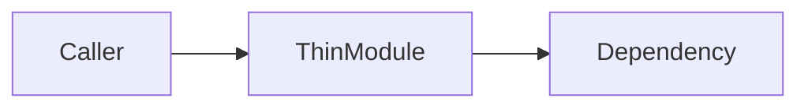
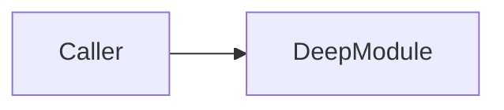

# Markdown Report Format

Write `.compozy/arch-reviews/<slug>.md` as the durable, offline-safe source of truth for one target. Render the HTML twin from the same canonical candidate records.

## Stable document shape

Use this section order on every run:

```markdown
# Architecture audit: <target>

Audit date: <YYYY-MM-DD>
Target: `<canonical-area>`
Slug: `<slug>`
Scope: <full|sampled with rule>
Source files: <count>

## Top pick

...

## Candidate index

...

## Candidates

...

## Suggested sequence

...

## Audit notes

...
```

Keep headings present and in this order. Omit volatile timestamps, random IDs, environment noise, and discovery-order details. Use the audit date and deterministic candidate ordering so re-audit diffs describe architectural change.

For zero candidates, write `## Top pick` followed by `Healthy target — no credible deepening candidate found.` Keep `## Candidates` with `No candidates.` and omit the index/sequence contents rather than inventing a pick.

## Top pick

For a non-empty audit, lead with exactly one top pick:

```markdown
## Top pick

### Deepen `<module>`

- Depth problem: <current interface burden>
- Deepening move: <concrete smaller interface and hidden implementation>
- Why first: <observed maintainability cost or bug risk>
- Full evidence: [candidate title](#candidate-<stable-id>)
```

For one candidate, use it here and in its full evidence section without adding `1 of 1` wording. Keep all other candidates secondary.

## Candidate index and anchors

Add explicit stable anchors before every candidate so large reports remain navigable regardless of renderer slug rules:

```markdown
- [Collapse the order intake pipeline](#candidate-order-intake)

<a id="candidate-order-intake"></a>

### Collapse the order intake pipeline
```

Derive the candidate ID from its canonical module path with the same lowercase/non-alphanumeric-collapse rule as the report slug. Disambiguate a collision with a deterministic lexical suffix, never a random value.

## Candidate record

Use the same field order for every candidate:

1. module;
2. strength badge text;
3. dependency category;
4. files/modules and representative callers/tests;
5. depth problem;
6. concrete deepening move;
7. deletion-test verdict and evidence;
8. maintainability-cost evidence;
9. before Mermaid diagram;
10. after Mermaid diagram;
11. locality, leverage, and test-surface wins;
12. settled-decision warning or overlap cross-reference when applicable.

Every candidate must contain both fenced diagrams:

````markdown
#### Before



#### After


````

Use stable Mermaid aliases and quote labels that contain punctuation. Keep a one-line text description below each fence so the evidence remains understandable when a renderer does not execute Mermaid.

## Candidate parity with HTML

Before publication, compare both rendered outputs against the canonical record set. Require the same:

- candidate count, stable IDs, and ordering;
- titles and module names;
- `Strong`, `Worth exploring`, or `Speculative` badges;
- deletion-test verdicts;
- top-pick ID;
- settled-decision callouts.

Abort publication when parity cannot be proven. The markdown may carry more prose for accessibility, but it must not contain a candidate absent from HTML or vice versa.

## Escaping and rendering safety

- Escape a table cell pipe as `\|` and replace embedded newlines with `<br>`.
- Escape HTML-sensitive repository text before placing it in raw anchor or HTML contexts.
- Wrap file paths, module paths, identifiers, and short interface names in backticks; escape embedded backticks or use a longer code span delimiter.
- Use quoted Mermaid labels and safe stable aliases rather than inserting raw paths as node IDs.
- Keep URLs in normal Markdown link syntax and escape closing parentheses when needed.
- Never place user- or repository-derived text into an unclosed fence or raw HTML attribute.

Prefer lists over tables when a field contains long prose or several special characters. Escaping must preserve meaning, not silently delete content.

## Suggested sequence and notes

Order the suggested sequence exactly like the ranked candidates. Explain only dependencies or blast-radius reasons that affect ordering; the top pick remains first.

Record sampled-scope limitations, malformed-decision soft warnings, previously declined matches, and missing report-link warnings under `## Audit notes`. Keep optional companion availability in the printed run summary rather than letting it alter candidate content.

## Publication

Create `.compozy/arch-reviews/` when absent. Render to a temporary sibling, verify anchors, fence balance, candidate parity, and one top-pick section, then atomically replace the deterministic markdown path. When `.compozy/**` is ignored, still write the file and report that it is untracked; never edit `.gitignore`.
