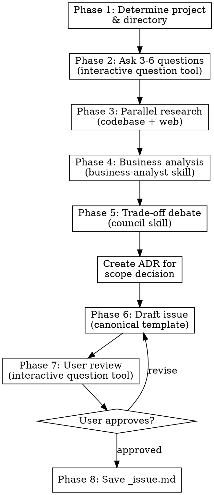

# Create Issue

Transform a raw feature idea into a structured, research-backed issue spec that serves as the foundation for PRD creation.

<HARD-GATE>
Do NOT write the issue file until ALL phases are complete and the user has approved the final draft.
Do NOT skip the research phase — every issue MUST be enriched with market data.
Do NOT skip user interactions — the user MUST participate in shaping the issue at every decision point.
This applies to EVERY issue regardless of perceived simplicity.
</HARD-GATE>

## Asking Questions

When this skill instructs you to ask the user a question, you MUST use your runtime's dedicated interactive question tool — the tool or function that presents a question to the user and **pauses execution until the user responds**. Do not output questions as plain assistant text and continue generating; always use the mechanism that blocks until the user has answered.

If your runtime does not provide such a tool, present the question as your complete message and stop generating. Do not answer your own question or proceed without user input.

## Anti-Pattern: "This Idea Is Too Simple For Full Research"

Every issue goes through the full research and debate process. A single button, a minor workflow tweak, a configuration option — all of them. "Simple" ideas are where unexamined business assumptions cause the most rework downstream in the PRD. The process can be brief for genuinely simple ideas, but you MUST research and debate before writing.

## Required Inputs

- Feature idea or problem description.
- Optional: existing `_issue.md` file for update mode.

## Checklist

You MUST create a task for each phase and complete them in order:

1. **Determine project & directory** — derive slug, create `.compozy/tasks/<slug>/` and `adrs/`
2. **Understand the idea** — ask 3-6 targeted questions to refine scope and intent
3. **Research the market** — web research for competitive intelligence and market data + codebase exploration
4. **Analyze business viability** — invoke `business-analyst` skill for KPIs, personas, and success metrics
5. **Debate trade-offs** — invoke `council` skill to challenge assumptions and surface risks
6. **Draft the issue** — write using the canonical template from `references/issue-template.md`
7. **Review with user** — present the draft, iterate until approved
8. **Save the file** — write to `.compozy/tasks/<slug>/_issue.md`

## Workflow

### Phase 1: Determine the project name and working directory

- Derive the slug from the feature idea provided by the user.
- Use `.compozy/tasks/<slug>/` as the target directory.
- If `_issue.md` already exists in the target directory, read it and operate in update mode.
- If the directory does not exist, create it.
- Create `.compozy/tasks/<slug>/adrs/` directory if it does not exist.

### Phase 2: Understand the idea (3-6 questions)

- Follow the question protocol in `references/question-protocol.md`.
- Ask 3-6 questions to refine scope, intent, target user, and success criteria.
- Ask only one question per message.
- Prefer multiple-choice questions when the options can be predetermined.
- Include a fallback option (e.g., "D) Other — describe") for flexibility.
- Complete at least one full clarification round before proceeding to research.

### Phase 3: Research (codebase + web)

Spawn two parallel Agent tool calls:

**Agent 1 — Codebase exploration:**
- Explore for relevant patterns, existing features, and architecture.
- Identify integration points and dependencies.

**Agent 2 — Web research (3-7 searches):**
- Use Exa MCP tools (`mcp__exa__web_search_exa`, `mcp__exa__get_code_context_exa`) when available.
- If Exa is unavailable, fall back to any available web search tool.
- If no web search tools are available, note the limitation and proceed with codebase exploration only.
- Vary query angles across at least 3 searches:
  1. **Competitive landscape:** `"{feature category} tools for {domain} 2025 2026"`
  2. **Market data:** `"{problem} market size OR adoption rate OR statistics"`
  3. **Technical approach:** `"{technical solution} architecture OR implementation best practices"`
  4. **User expectations:** `"{feature} UX patterns OR user experience best practices"` (if relevant)
  5. **Pricing/cost:** `"{service/API} pricing OR cost comparison 2025 2026"` (if relevant)

**After both agents complete**, merge findings and present a research summary to the user:

```
**Codebase findings:**
- {Relevant existing feature/pattern}
- {Integration point}

**Market research:**
- {Competitor 1}: {what it does}
- {Competitor 2}: {what it does}
- **Potential differentiator:** {what we can do differently}
- **Relevant data:** {statistics found}
```

### Phase 4: Business analysis

- Use the installed `business-analyst` skill to evaluate the idea with the refined context from phases 2-3.
- Request: KPI framework, success metrics, personas, and viability assessment.
- If the `business-analyst` skill is not available, perform the analysis inline:
  - Define 3-6 KPIs with measurable targets.
  - Identify success criteria and risk factors.
  - Assess viability based on research findings.

**10x Evaluation (6 Criteria):**

After business analysis, score the feature on these 6 criteria:

| Criteria            | Question                                            | Score                  |
| ------------------- | --------------------------------------------------- | ---------------------- |
| **Impact**          | How much more valuable does this make the product?  | Must do/Strong/Maybe/Pass |
| **Reach**           | What % of users would this affect?                  | Must do/Strong/Maybe/Pass |
| **Frequency**       | How often would users encounter this value?         | Must do/Strong/Maybe/Pass |
| **Differentiation** | Does this set us apart or just match competitors?   | Must do/Strong/Maybe/Pass |
| **Defensibility**   | Is this easy to copy or does it compound over time? | Must do/Strong/Maybe/Pass |
| **Feasibility**     | Can we actually build this?                         | Must do/Strong/Maybe/Pass |

This evaluation informs the issue's priority and feeds into the council debate.
Present the analysis to the user before proceeding.

### Phase 5: Trade-off debate

- Use the installed `council` skill in embedded mode to debate:
  - **Scope:** Is the V1 scope right? Too much? Too little?
  - **Priority:** Where should this rank vs other planned features?
  - **Technical approach:** Are there simpler alternatives?
  - **Risks:** What could go wrong? What are the hidden dependencies?
  - **10x Challenge:** Is this truly high-leverage or just incremental? Is there a more ambitious version worth exploring? Could a simpler version deliver disproportionate value?
- If the `council` skill is not available, perform the debate inline:
  - Present 2-3 perspectives (pragmatic engineer, product mind, devil's advocate).
  - Surface key trade-offs and risks.
  - Recommend an approach with justification.
- Extract: key trade-offs, recommended approach, items for out-of-scope (V1), optional stretch goal for V2+.
- After the debate, create an ADR for the scope decision:
  - Read the ADR template from the `cy-create-prd` skill references or use the standard ADR format.
  - Determine the next ADR number by listing existing files in `.compozy/tasks/<slug>/adrs/`.
  - Fill the template: recommended scope as "Decision", alternatives as "Alternatives Considered", trade-offs as "Consequences". Set Status to "Accepted" and Date to today.
  - Write the ADR to `.compozy/tasks/<slug>/adrs/adr-NNN.md` (zero-padded 3-digit number).

### Phase 6: Draft the issue

- Read `references/issue-template.md` and fill every applicable section with gathered context.
- Include an "Architecture Decision Records" section listing all ADRs created during this session.

**Mandatory sections** (ALWAYS include):
1. **Overview** — what, who, why
2. **Problem** — enriched with market data from Phase 3
3. **Core Features** — table with numbered features, priorities, descriptions
4. **KPIs** — from business-analyst output (Phase 4)
5. **Feature Assessment** — 10x evaluation table from Phase 4
6. **Council Insights** — key findings from Phase 5
7. **Out of Scope (V1)** — from council output (Phase 5)
8. **Architecture Decision Records** — ADRs from this session
9. **Open Questions** — unresolved items

**Optional sections** (include when relevant):

| Section                            | When to Include                                          |
| ---------------------------------- | -------------------------------------------------------- |
| Summary / Differentiator           | Feature has a clear competitive angle                    |
| Integration with Existing Features | Feature modifies or extends existing features            |
| Sub-Features                       | Feature is large enough to split into multiple issues    |
| Cost Estimate                      | Feature has operational costs (paid APIs, storage)       |

**Writing rules:**
- Apply `writing-clearly-and-concisely` skill principles: prefer active voice, omit needless words, use definite and specific language over vague generalities. Every sentence should earn its place.
- Language: **English**.
- Tone: clear, technical, consistent with existing project artifacts.
- Tables: use markdown tables for structured data.
- Features: minimum 3, maximum 10, ordered by priority.
- KPIs: minimum 3, maximum 6, with numeric targets.
- Exclusions: minimum 3 items with justification.

Present the complete draft to the user for review.

### Phase 7: Review with user

Present the draft and ask using the interactive question tool:

- "Here is the issue draft. Please review and let me know:"
- A) Approved — save as is
- B) Adjust specific sections (tell me which ones)
- C) Rewrite section X (tell me what to change)
- D) Discard and start over

If B or C: make the changes and present again.
If D: go back to Phase 2.

### Phase 8: Save the issue file

1. Generate the slug: kebab-case, 2-5 words, descriptive (e.g., `smart-thumbnail-suggestions`).
2. Ask the user to confirm the filename using the interactive question tool:
   - "Save as `.compozy/tasks/<slug>/_issue.md`? (A) Yes / (B) Different name"
3. Write the file to `.compozy/tasks/<slug>/_issue.md`.
4. Confirm the file path to the user.
5. Remind the user that the next step is to create a PRD using `cy-create-prd` from this issue.

## Process Flow



## Error Handling

- If the user provides insufficient context to complete a section, note it in the Open Questions section rather than guessing.
- If web research tools (Exa MCP, web search) are unavailable, proceed with codebase exploration only and note the limitation.
- If the `business-analyst` or `council` skills are not installed, perform the analysis and debate inline as described in phases 4 and 5.
- If the target directory cannot be created, stop and report the filesystem error.
- If operating in update mode, preserve sections the user has not asked to change.

## Key Principles

- **One question at a time** — Do not overwhelm with multiple questions in a single message
- **Multiple choice preferred** — Always offer options before open-ended questions
- **Research before writing** — Never write an issue without market data
- **Incremental validation** — Present analysis and draft for approval before saving
- **Business focus only** — Never ask about implementation; that belongs in TechSpec
- **Scope discipline** — Aggressively trim scope to a viable V1
- **Pipeline awareness** — The issue feeds into `cy-create-prd`; focus on WHAT and WHY, not HOW
- **Template compliance** — Every issue MUST follow the canonical template
- **Language consistency** — Write all issue content in English
