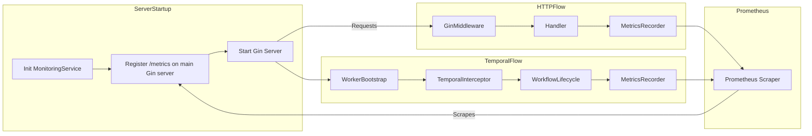

# Technical Specification: Monitoring for Compozy

## 1. Executive Summary

Compozy requires centralized, low-overhead observability for its HTTP API, Temporal workflows, and system health. This specification defines a single, process-wide `engine/infra/monitoring` package that provides a shared OpenTelemetry MeterProvider with a Prometheus exporter on `/metrics`. All feature and domain packages plug into this provider via middleware, interceptors, or package-level helpers, ensuring consistent metric naming, labels, and registration.

## 2. System Architecture

### 2.1 Domain Placement

- `engine/infra/monitoring`: Core monitoring package containing:
    - `monitoring.go`: Initializes `MeterProvider` and Prometheus exporter
    - `middleware/gin.go`: Gin HTTP middleware for HTTP metrics
    - `interceptor/temporal.go`: Temporal interceptor for workflow metrics
- `infra/server`: Imports `MonitoringService` and registers `/metrics` route using the main Gin server
- Other domains (`engine/worker`, `engine/task`, etc.): Import or receive a `Meter` from `MonitoringService` for custom instrumentation

### 2.2 Component Relationships



## 3. Technical Requirements

### 3.1 Core Requirements

- **Single Scrape Endpoint:** Exactly one `/metrics` HTTP handler per process, served by the main Gin server
- **Shared Provider:** A single `otel/sdk/metric.MeterProvider` configured with the Prometheus exporter
- **Graceful Shutdown:** Reuse the main Gin server; no separate HTTP server or additional resources requiring cleanup
- **Context Handling:** All service methods performing I/O or long-running operations must accept `context.Context` as first parameter

### 3.2 Naming & Labels

All counters/gauges/histograms defined centrally. Labels must be low-cardinality and adhere to the following allow-list:

| Metric Category | Allowed Labels                         |
| --------------- | -------------------------------------- |
| HTTP            | `method`, `path`, `status_code`        |
| Temporal        | `workflow_type`                        |
| System          | `version`, `commit_hash`, `go_version` |

**Label Enforcement:** CI pipeline must include label validation using a custom linter that fails builds on disallowed labels.

### 3.3 Performance Constraints

- **Aggregation Strategy:** Expose per-instance gauges and rely on PromQL `sum()` for global totals
- **Total Overhead:** <0.5% under normal load (formally validated)
- **Histogram Buckets:** Default buckets `[.005, .01, .025, .05, .1, .25, .5, 1, 2.5, 5, 10]` (10s upper bound covers typical API operations; future changes require breaking change analysis)
- **Route Templating:** HTTP middleware must use `.WithRouteTag` to ensure parameterized routes (e.g., `/api/v1/users/:id`) rather than high-cardinality actual paths

### 3.4 Performance Validation Plan

- **Tooling:** `ghz` for load generation, `pprof` for profiling
- **Environment:** AWS `t3.medium` instance (2vCPU, 4GB RAM)
- **Load Profile:** 1,000 requests per second for 5 minutes against representative endpoints
- **Success Criteria:** 95th percentile latency increase ≤0.5%, CPU/memory usage within 2% of baseline
- **Ownership:** SRE team executes validation and provides sign-off
- **Baseline Measurement:** Must be taken with monitoring completely disabled for accurate comparison

### 3.5 Compatibility

- **Gin Integration:** Compatible with existing Gin-based HTTP server
- **Temporal Integration:** Support Temporal Go SDK interceptor patterns
- **Project Standards:** Full adherence to constructor patterns, testing standards, and architectural rules

## 4. Implementation Design

### 4.1 Core Interfaces

```go
// MonitoringService encapsulates instrumentation logic.
type MonitoringService struct {
    meter    metric.Meter
    exporter *prometheus.Exporter
    provider *metric.MeterProvider
    // configuration fields
}

// NewMonitoringService creates a new monitoring service following mandatory constructor pattern.
func NewMonitoringService(ctx context.Context, cfg *Config) (*MonitoringService, error) {
    if cfg == nil {
        cfg = DefaultConfig()
    }
    // build MeterProvider + Prometheus exporter
    // return no-op meter on exporter init failure (log error via pkg/logger)
}

// Meter returns the OpenTelemetry meter for custom instrumentation.
func (m *MonitoringService) Meter() metric.Meter {
    return m.meter
}

// GinMiddleware returns a Gin middleware for HTTP metrics with proper route templating.
func (m *MonitoringService) GinMiddleware() gin.HandlerFunc {
    // Uses otelgin with .WithRouteTag to ensure parameterized paths
}

// TemporalInterceptor returns a Temporal interceptor for workflow metrics.
func (m *MonitoringService) TemporalInterceptor(ctx context.Context) (interceptor.ClientInterceptor, error) {
    // Handles workflow lifecycle events
}

// ExporterHandler returns an http.Handler for the Prometheus exporter.
func (m *MonitoringService) ExporterHandler() http.Handler {
    // Returns no-op handler if exporter initialization failed
}

// Shutdown performs graceful cleanup (if any resources need cleanup).
func (m *MonitoringService) Shutdown(ctx context.Context) error {
    // Currently no-op as we reuse main server
}
```

### 4.2 Service Construction

```go
// NewMonitoringService follows mandatory constructor pattern with nil-safe configuration.
func NewMonitoringService(ctx context.Context, cfg *Config) (*MonitoringService, error) {
    if cfg == nil {
        cfg = DefaultConfig()
    }

    // Initialize Prometheus exporter
    exporter, err := prometheus.New()
    if err != nil {
        logger.Error("Failed to initialize Prometheus exporter", "error", err)
        return &MonitoringService{meter: noop.NewMeterProvider().Meter("noop")}, nil
    }

    // Create MeterProvider with exporter
    provider := metric.NewMeterProvider(metric.WithReader(exporter))
    meter := provider.Meter("compozy")

    return &MonitoringService{
        meter:    meter,
        exporter: exporter,
        provider: provider,
    }, nil
}
```

### 4.3 Key Algorithms & Logic

#### 4.3.1 Metric Registration

Metrics defined and registered centrally within their respective modules:

```go
// In middleware/gin.go
var (
    httpRequestsTotal    metric.Int64Counter
    httpRequestDuration  metric.Float64Histogram
    httpRequestsInFlight metric.Int64UpDownCounter
    initOnce            sync.Once
)

func initMetrics(meter metric.Meter) {
    initOnce.Do(func() {
        httpRequestsTotal, _ = meter.Int64Counter(
            "compozy_http_requests_total",
            metric.WithDescription("Total HTTP requests"),
        )
        httpRequestDuration, _ = meter.Float64Histogram(
            "compozy_http_request_duration_seconds",
            metric.WithDescription("HTTP request latency"),
            metric.WithExplicitBucketBoundaries(.005, .01, .025, .05, .1, .25, .5, 1, 2.5, 5, 10),
        )
        httpRequestsInFlight, _ = meter.Int64UpDownCounter(
            "compozy_http_requests_in_flight",
            metric.WithDescription("Currently active HTTP requests"),
        )
    })
}
```

#### 4.3.2 Custom Metrics Pattern

```go
// Pattern for other packages to safely initialize custom metrics
var taskProcessedCounter metric.Int64Counter
var once sync.Once

func TaskProcessedCounter(meter metric.Meter) metric.Int64Counter {
    once.Do(func() {
        taskProcessedCounter, _ = meter.Int64Counter(
            "compozy_task_items_processed_total",
            metric.WithDescription("Total task items processed"),
        )
    })
    return taskProcessedCounter
}
```

### 4.4 Database Schema

No database schema changes required.

### 4.5 API Design

- **Endpoint:** `/metrics` (not versioned under `/api/v0/` as it's operational)
- **Method:** GET
- **Response:** Prometheus exposition format (text/plain)
- **Swagger Documentation:** Must include clear purpose, format description, and operational usage notes

## 5. Integration Points

### 5.1 Gin Server Integration

```go
// In infra/server package
ms, err := monitoring.NewMonitoringService(ctx, cfg.Monitoring)
if err != nil {
    return fmt.Errorf("failed to initialize monitoring: %w", err)
}

r := gin.New()
r.Use(ms.GinMiddleware()) // Add before other middleware
r.GET("/metrics", gin.WrapH(ms.ExporterHandler()))
```

### 5.2 Temporal Worker Integration

```go
// In engine/worker package
interceptor, err := ms.TemporalInterceptor(ctx)
if err != nil {
    logger.Error("Failed to create Temporal interceptor", "error", err)
    // Continue without interceptor rather than failing
}
if interceptor != nil {
    workerOptions.Interceptors = append(workerOptions.Interceptors, interceptor)
}
```

## 6. Error Handling & Resilience

### 6.1 Initialization Failures

- If Prometheus exporter initialization fails:
    - Log error via `pkg/logger.Error`
    - Return no-op meter to prevent nil pointer panics
    - `/metrics` endpoint returns empty response or 503 status

### 6.2 Runtime Failures

- Middleware/interceptor errors must not abort requests or workflows
- Catch all instrumentation errors and log via `pkg/logger.Error`
- Never propagate monitoring errors to business logic

### 6.3 Fallback Behavior

- In tests or disabled mode, `NewMonitoringService` returns no-op implementations
- Graceful degradation: application continues functioning without metrics

## 7. Security Implementation

### 7.1 Access Control

**MVP Approach:** No authentication required for the `/metrics` endpoint per PRD requirements.

**Production Recommendations (Future):**

- Network-level restriction via Ingress controller rules
- Optional bearer token validation for additional security layers

**Example Network Restriction (Nginx Ingress):**

```yaml
apiVersion: networking.k8s.io/v1
kind: Ingress
metadata:
    annotations:
        nginx.ingress.kubernetes.io/whitelist-source-range: "10.0.0.0/8,172.16.0.0/12"
spec:
    rules:
        - http:
              paths:
                  - path: /metrics
                    pathType: Exact
                    backend:
                        service:
                            name: compozy
                            port:
                                number: 8080
```

### 7.2 Data Security

- **No PII:** Never include personally identifiable information in labels or metric values
- **Path Sanitization:** Ensure HTTP path labels use route templates to prevent ID leakage
- **Structured Logging:** Use `pkg/logger` exclusively; no `fmt.Printf` or direct console output

## 8. Testing Strategy

### 8.1 Unit Testing Requirements

All tests must follow project standards:

```go
func TestMonitoringService_GinMiddleware(t *testing.T) {
    t.Run("Should increment request counter on successful request", func(t *testing.T) {
        // Use oteltest.NewMeterProvider() for hermetic testing
        mp := oteltest.NewMeterProvider()
        ms := monitoring.NewForTest(mp)

        // Test middleware behavior
        // Use testify/assert for assertions
        assert.Equal(t, expected, actual)
    })

    t.Run("Should handle meter initialization failure gracefully", func(t *testing.T) {
        // Test negative case
    })
}
```

### 8.2 Negative Testing

Required test cases:

- Exporter initialization failure returns no-op meter and logs error
- Middleware panic recovery (malformed meter configuration)
- High-cardinality label rejection or sanitization
- Temporal interceptor failure doesn't break workflow execution

### 8.3 Integration Testing

```go
func TestMetricsEndpoint_Integration(t *testing.T) {
    t.Run("Should serve metrics in Prometheus format", func(t *testing.T) {
        // Start test server with middleware
        // Make test requests
        // Scrape /metrics endpoint
        // Validate metric families and values using promhttp.HandlerFor with test registry
    })
}
```

### 8.4 Performance Testing

- Load test with `ghz` before and after instrumentation
- Profile with `pprof` to identify overhead sources
- Validate <0.5% latency increase and <2% resource usage increase

## 9. Monitoring & Observability

### 9.1 Bootstrap Logging

```go
logger.Info("Initializing monitoring service", "enabled", cfg.Enabled)
logger.Info("Metrics endpoint registered", "path", cfg.Path)
```

### 9.2 Error Logging

```go
logger.Error("Prometheus exporter initialization failed", "error", err)
logger.Error("Metric recording failed", "metric", "http_requests_total", "error", err)
```

### 9.3 Health Metrics

Future enhancement: Expose monitoring system health via `compozy_monitoring_health` gauge.

## 10. Deployment Considerations

### 10.1 Configuration Management

Environment variables:

- `MONITORING_ENABLED=true|false`: Global enable/disable

Project configuration (`compozy.yaml`):

```yaml
monitoring:
    enabled: true
    path: /metrics # Optional, defaults to /metrics
```

### 10.2 Kubernetes Integration

**Pod Annotations:**

```yaml
apiVersion: v1
kind: Pod
metadata:
    annotations:
        prometheus.io/scrape: "true"
        prometheus.io/path: "/metrics"
        prometheus.io/port: "8080"
```

**ServiceMonitor Example:**

```yaml
apiVersion: monitoring.coreos.com/v1
kind: ServiceMonitor
metadata:
    name: compozy-monitor
    labels:
        team: backend
spec:
    selector:
        matchLabels:
            app: compozy
    endpoints:
        - port: http
          path: /metrics
```

### 10.3 Dependencies

Required `go.mod` additions:

- `go.opentelemetry.io/otel`
- `go.opentelemetry.io/otel/exporters/prometheus`
- `go.opentelemetry.io/contrib/instrumentation/github.com/gin-gonic/gin/otelgin`

### 10.4 Rollback Procedure

1. Set `MONITORING_ENABLED=false` in environment configuration
2. Update `monitoring.enabled: false` in `compozy.yaml`
3. Redeploy the application
4. Remove ServiceMonitor resources from Kubernetes
5. Clear Pod annotations that trigger Prometheus scraping

## 11. Project Configuration Schema

### 11.1 Configuration Structure

```go
type Config struct {
    Enabled bool   `yaml:"enabled" env:"MONITORING_ENABLED" default:"false"`
    Path    string `yaml:"path" default:"/metrics"`
}

func DefaultConfig() *Config {
    return &Config{
        Enabled: false,
        Path:    "/metrics",
    }
}
```

### 11.2 Example Project Configuration

```yaml
name: my-monitored-project
version: 0.1.0

workflows:
    - source: ./workflow.yaml

monitoring:
    enabled: true
    path: /metrics

runtime:
    permissions:
        - --allow-read
        - --allow-net
        - --allow-env
```

## 12. Technical Risks & Mitigation

| Risk                              | Impact                    | Mitigation                                                  |
| --------------------------------- | ------------------------- | ----------------------------------------------------------- |
| OTEL dependency conflicts         | Build failures            | Pin versions, review dependency tree, isolate if necessary  |
| High cardinality explosion        | Memory/performance issues | Implement CI label validation, enforce allow-list           |
| Single exporter contention        | Performance degradation   | Use single provider instance, avoid per-package exporters   |
| Performance regression            | User experience impact    | Formal validation per Performance Validation Plan           |
| Route template misconfiguration   | High cardinality paths    | Use `.WithRouteTag`, validate in tests                      |
| Monitoring initialization failure | Loss of observability     | Graceful fallback to no-op meters, structured error logging |

## 13. Metrics Reference

### 13.1 Complete Metric Definitions

| Metric Name                                  | Type      | Labels                                 | Description                     | Bucket/Range                                       |
| -------------------------------------------- | --------- | -------------------------------------- | ------------------------------- | -------------------------------------------------- |
| `compozy_http_requests_total`                | Counter   | `method`, `path`, `status_code`        | Total HTTP requests             | N/A                                                |
| `compozy_http_request_duration_seconds`      | Histogram | `method`, `path`                       | HTTP request latency            | [.005, .01, .025, .05, .1, .25, .5, 1, 2.5, 5, 10] |
| `compozy_http_requests_in_flight`            | Gauge     | -                                      | Currently active requests       | N/A                                                |
| `compozy_temporal_workflow_started_total`    | Counter   | `workflow_type`                        | Started workflows               | N/A                                                |
| `compozy_temporal_workflow_completed_total`  | Counter   | `workflow_type`                        | Completed workflows             | N/A                                                |
| `compozy_temporal_workflow_failed_total`     | Counter   | `workflow_type`                        | Failed workflows                | N/A                                                |
| `compozy_temporal_workflow_duration_seconds` | Histogram | `workflow_type`                        | Workflow execution time         | [.005, .01, .025, .05, .1, .25, .5, 1, 2.5, 5, 10] |
| `compozy_temporal_workers_running_total`     | Gauge     | -                                      | Currently running workers       | N/A                                                |
| `compozy_temporal_workers_configured_total`  | Gauge     | -                                      | Configured workers per instance | N/A                                                |
| `compozy_build_info`                         | Gauge     | `version`, `commit_hash`, `go_version` | Build information (value=1)     | N/A                                                |
| `compozy_uptime_seconds_total`               | Counter   | -                                      | Service uptime (monotonic)      | N/A                                                |

### 13.2 Label Cardinality Guidelines

- **HTTP `path`:** Must use route templates (e.g., `/api/v1/users/:id`)
- **Temporal `workflow_type`:** Static workflow type names only
- **System labels:** Build-time values only

## 14. Non-Goals

- Real-time alerting rule definitions within application code
- Pre-built Grafana dashboards
- Distributed tracing setup (metrics-only for this phase)
- Custom histogram bucket configuration (fixed for consistency)
- Authentication/authorization for MVP

## 15. Open Questions

_All previous questions resolved._

## 16. Glossary

- **MeterProvider:** OpenTelemetry component that creates Meter instances
- **Exporter:** Component that sends telemetry data to backends (Prometheus)
- **Instrument:** Specific counter, gauge, or histogram for measurements
- **Route Template:** Parameterized path pattern (e.g., `/users/:id` vs `/users/123`)

---

**Decision:** Adopt a single, process-wide monitoring package (`engine/infra/monitoring`) with per-package metric definitions via the shared MeterProvider. This aligns with clean architecture, provides a single `/metrics` endpoint, and avoids boilerplate duplication or cardinality pitfalls while maintaining no authentication for the MVP phase.
