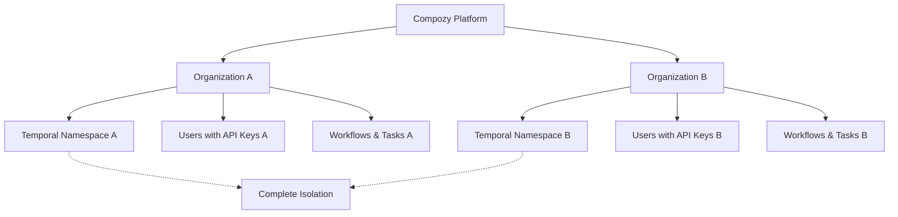

# Multi-Tenant Support with API Key Authentication - Product Requirements Document

**Document Version**: 1.0  
**Last Updated**: January 15, 2025  
**Author**: PRD Creator Agent  
**Status**: Draft

## 1. Overview

### Executive Summary

This PRD defines the implementation of multi-tenant support for Compozy using API key authentication, enabling complete isolation between different customer organizations while maintaining a single Compozy deployment. This foundational feature transforms Compozy from a single-user system into an enterprise-ready platform capable of serving multiple organizations securely.

### Problem Statement

Currently, Compozy operates as a single-tenant system where all workflows, tasks, and data exist in a shared space without organizational boundaries. This prevents Compozy from serving multiple customers simultaneously, as there is no mechanism to isolate data, control access, or manage organizational membership. Organizations requiring workflow orchestration cannot safely share a Compozy instance with other companies due to data privacy and security concerns.

### Proposed Solution

Implement a comprehensive multi-tenant architecture with:

- **Organization entities** that serve as the primary isolation boundary
- **User management** with role-based permissions (admin, manager, customer)
- **API key authentication** system replacing current auth mechanisms
- **Temporal namespace isolation** ensuring workflow execution boundaries
- **Complete data separation** through organization-scoped data access
- **REST APIs and CLI tools** for organization and user management

### Key Benefits

- **Enterprise Readiness**: Enable serving multiple organizations securely
- **Data Isolation**: Complete separation between customer data and workflows
- **Scalable Authentication**: API key-based system supporting enterprise integrations
- **Operational Efficiency**: Single deployment serving multiple customers
- **Revenue Enablement**: Foundation for B2B/SaaS business model

### Visual Context



## 2. Goals & Objectives

### Business Goals

1. **Multi-Customer Platform**: Transform Compozy into a platform capable of serving multiple organizations simultaneously with complete data isolation
2. **Enterprise Market Access**: Enable targeting enterprise customers who require secure, isolated workflow orchestration environments
3. **Scalable Architecture**: Establish foundation for future SaaS features including billing, advanced permissions, and compliance controls
4. **Developer Experience**: Provide intuitive API key-based authentication that integrates seamlessly with existing development workflows

### User Goals

1. **Organization Administrators**: Easily manage their organization's users, API keys, and access permissions
2. **Managers**: Control user access and API key lifecycle within their organization
3. **Customers**: Access organization-scoped workflows and data through secure API keys
4. **Developers**: Integrate with Compozy using standard API key authentication patterns

### Success Criteria

- [ ] Complete data isolation between organizations verified through security testing
- [ ] API key authentication system operational with role-based access control
- [ ] Organization onboarding process completed in under 10 minutes
- [ ] All existing Compozy functionality preserved within organization context
- [ ] Temporal workflows execute in organization-specific namespaces
- [ ] CLI tools provide intuitive organization and user management

## 3. User Stories

### Epic: Organization Management

#### Story 1: Create Organization (Admin)

**As a** system administrator  
**I want to** create new organizations  
**So that** I can onboard new customers with isolated environments

**Acceptance Criteria:**

- [ ] Admin can create organization with unique name
- [ ] Temporal namespace automatically created for organization
- [ ] Organization receives unique identifier for all subsequent operations
- [ ] Creation process includes initial admin user setup

#### Story 2: Manage Organization (Admin/Manager)

**As an** organization admin or manager  
**I want to** view and update organization settings  
**So that** I can maintain our organization's configuration

**Acceptance Criteria:**

- [ ] View organization details including member count and API key usage
- [ ] Update organization name and settings (admin only)
- [ ] Monitor organization-level metrics and activity
- [ ] Suspend/reactivate organization (admin only)

### Epic: User Management

#### Story 3: Add Users to Organization (Admin/Manager)

**As an** admin or manager  
**I want to** add users to my organization  
**So that** team members can access organization resources

**Acceptance Criteria:**

- [ ] Add user with email and role assignment (admin/manager/customer)
- [ ] User automatically associated with organization
- [ ] Email validation ensures uniqueness within organization
- [ ] Role-based permissions applied immediately upon creation

#### Story 4: Manage User Roles (Admin/Manager)

**As an** admin or manager  
**I want to** update user roles and status  
**So that** I can control access levels as team needs change

**Acceptance Criteria:**

- [ ] Update user role between admin/manager/customer
- [ ] Suspend/reactivate user accounts
- [ ] Remove users from organization
- [ ] View user activity and API key usage

### Epic: API Key Management

#### Story 5: Generate API Keys (Admin/Manager)

**As an** admin or manager  
**I want to** generate API keys for users  
**So that** they can authenticate with Compozy programmatically

**Acceptance Criteria:**

- [ ] Generate API key with user-friendly name
- [ ] Set expiration date (optional)
- [ ] Configure rate limiting per API key
- [ ] Display API key once upon creation for security
- [ ] API key inherits user's organization and role permissions

#### Story 6: Manage API Key Lifecycle (Admin/Manager/Self)

**As a** user with appropriate permissions  
**I want to** manage API key lifecycle  
**So that** I can maintain security and control access

**Acceptance Criteria:**

- [ ] List all API keys for a user
- [ ] Update API key expiration and rate limits
- [ ] Revoke API keys immediately
- [ ] View API key usage statistics and last used timestamp
- [ ] Users can manage their own API keys

### Epic: Secure API Access

#### Story 7: Authenticate with API Keys (Developer)

**As a** developer  
**I want to** use API keys to authenticate API requests  
**So that** I can integrate Compozy into my applications securely

**Acceptance Criteria:**

- [ ] Include API key in Authorization header: `Bearer ck_abc123...`
- [ ] API returns organization-scoped data only
- [ ] Invalid API keys return appropriate error messages
- [ ] Rate limiting enforced per API key
- [ ] API key expiration respected

#### Story 8: Access Organization Data (Customer)

**As a** customer user  
**I want to** access only my organization's workflows and tasks  
**So that** I can work within my organization's boundaries

**Acceptance Criteria:**

- [ ] All API responses filtered to organization scope
- [ ] Cannot access other organizations' data
- [ ] Workflows execute in organization's Temporal namespace
- [ ] Error messages do not leak information about other organizations

## 4. Core Features & Requirements

### Feature 1: Organization Management

**Description**: Complete organization lifecycle management including creation, configuration, and membership control.

**Functional Requirements**:

- FR1.1: System admin can create organizations with unique names and auto-generated Temporal namespaces
- FR1.2: Organization details include ID, name, namespace, creation date, status, and member count
- FR1.3: Admin can update organization settings and suspend/reactivate organizations
- FR1.4: Organization deletion requires confirmation and cleanup of all associated data
- FR1.5: API endpoints support CRUD operations with appropriate permission validation

**User Flow**:

1. Admin calls POST /api/v0/organizations with organization name
2. System validates name uniqueness and creates organization record
3. System auto-generates Temporal namespace: `compozy-{org-slug}`
4. System creates namespace in Temporal cluster
5. System returns organization details including generated ID

### Feature 2: User Management with Role-Based Permissions

**Description**: User lifecycle management within organizations with three permission levels: admin, manager, and customer.

**Functional Requirements**:

- FR2.1: Three user roles with distinct permissions:
    - **Admin**: Global permissions across all organizations
    - **Manager**: Full permissions within assigned organization
    - **Customer**: Read/execute permissions within assigned organization
- FR2.2: Users belong to exactly one organization (no multi-org support in MVP)
- FR2.3: Email addresses unique within organization scope
- FR2.4: User status management (active/suspended)
- FR2.5: Role assignment and updates by admin/manager users

**User Flow**:

1. Admin/Manager calls POST /api/v0/organizations/{org_id}/users
2. System validates email uniqueness within organization
3. System creates user record with organization association
4. System applies role-based permissions immediately
5. User can authenticate using generated API keys

### Feature 3: API Key Authentication System

**Description**: Secure API key generation, management, and authentication replacing existing auth mechanisms.

**Functional Requirements**:

- FR3.1: API keys formatted as 32-character strings with "ck\_" prefix
- FR3.2: API keys securely hashed using Argon2 before database storage
- FR3.3: API key configuration includes:
    - User-friendly name for identification
    - Expiration date (optional)
    - Rate limit per hour
    - Creation and last-used timestamps
- FR3.4: API key authentication validates organization context and user permissions
- FR3.5: Immediate revocation capability for security incidents

**User Flow**:

1. Admin/Manager calls POST /api/v0/users/{user_id}/api-keys
2. System generates secure random API key with "ck\_" prefix
3. System hashes API key and stores with configuration
4. System returns unhashed API key once for client storage
5. Client includes API key in subsequent requests: `Authorization: Bearer ck_abc123...`

### Feature 4: Multi-Tenant Data Access

**Description**: Organization-scoped data access ensuring complete isolation between tenants.

**Functional Requirements**:

- FR4.1: All database entities include org_id foreign key
- FR4.2: All queries automatically filtered by authenticated user's organization
- FR4.3: API endpoints return only organization-scoped data
- FR4.4: Cross-organization data access prevented at middleware level
- FR4.5: Error messages do not leak information about other organizations

**User Flow**:

1. Client makes authenticated API request with valid API key
2. Authentication middleware validates API key and extracts organization context
3. Request proceeds with organization ID injected into context
4. All database queries automatically filtered by organization ID
5. Response contains only organization-scoped data

### Feature 5: Temporal Namespace Isolation

**Description**: Complete workflow execution isolation using Temporal namespaces per organization.

**Functional Requirements**:

- FR5.1: Each organization receives dedicated Temporal namespace
- FR5.2: Dispatcher routes workflows to correct namespace based on organization context
- FR5.3: Worker activities maintain organization context throughout execution
- FR5.4: Scheduler executes workflows in organization-specific namespaces
- FR5.5: Signal handling respects namespace boundaries

**User Flow**:

1. User triggers workflow execution via API
2. System determines organization from authenticated context
3. Dispatcher routes workflow to organization's Temporal namespace
4. Workflow executes with organization context maintained
5. All activities and signals operate within namespace boundaries

## 5. User Experience

### API-First Design

The multi-tenant system prioritizes API-first design with consistent patterns across all endpoints. Authentication uses standard Bearer token format with API keys, and all responses maintain consistent JSON structure with organization-scoped data.

### CLI Command Workflows

```bash
# Organization management
compozy org create "Acme Corp"
compozy org list
compozy org show acme-corp

# User management
compozy user add john@acme.com --org=acme-corp --role=manager
compozy user list --org=acme-corp
compozy user update john@acme.com --role=customer

# API key management
compozy apikey create --user=john@acme.com --name="production-integration"
compozy apikey list --user=john@acme.com
compozy apikey revoke ak_abc123def456
```

### Error Handling and Feedback

- **Authentication Errors**: Clear messages for expired, invalid, or missing API keys
- **Permission Errors**: Specific feedback about required roles for actions
- **Validation Errors**: Detailed field-level validation messages
- **Rate Limiting**: Informative headers and error responses for rate limit violations

### Developer Onboarding Experience

1. **Organization Setup**: Admin creates organization via CLI or API
2. **User Creation**: Admin adds developer user with appropriate role
3. **API Key Generation**: Developer receives API key for integration
4. **Integration Testing**: Developer tests API access with organization-scoped data
5. **Production Usage**: Seamless scaling with additional API keys as needed

## 6. Technical Constraints

### Database Schema Requirements

**New Entities**:

```sql
organizations:
  - id (UUID, primary key)
  - name (string, unique)
  - temporal_namespace (string, unique)
  - status (enum: active, suspended)
  - created_at, updated_at (timestamps)

users:
  - id (UUID, primary key)
  - org_id (UUID, foreign key)
  - email (string, unique within organization)
  - role (enum: admin, manager, customer)
  - status (enum: active, suspended)
  - created_at, updated_at (timestamps)

api_keys:
  - id (UUID, primary key)
  - user_id (UUID, foreign key)
  - org_id (UUID, foreign key, denormalized)
  - key_hash (string, Argon2 hash)
  - name (string, user-friendly identifier)
  - expires_at (timestamp, nullable)
  - rate_limit_per_hour (integer)
  - created_at, last_used_at (timestamps)
  - status (enum: active, revoked)
```

**Multi-Tenant Foreign Keys**:
All existing entities require org_id foreign key:

- workflows table: add org_id
- tasks table: add org_id
- schedules table: add org_id
- workflow_states table: add org_id
- task_states table: add org_id

### Temporal Integration Requirements

- **Namespace Strategy**: Each organization gets unique namespace: `compozy-{org-slug}`
- **Dispatcher Integration**: Route workflows based on organization context from API key
- **Worker Context**: Maintain organization ID throughout activity execution
- **Signal Isolation**: Ensure signals remain within organization namespace boundaries
- **Scheduler Integration**: Execute scheduled workflows in correct namespace

### API Key Security Specifications

- **Format**: 32-character random strings with "ck\_" prefix for identification
- **Storage**: Hash using Argon2 with salt before database storage
- **Transmission**: HTTPS only, Bearer token format in Authorization header
- **Validation**: Constant-time comparison to prevent timing attacks
- **Audit Logging**: Track API key usage, failures, and security events

### Performance Requirements

- **API Response Time**: < 200ms for organization-filtered queries
- **API Key Validation**: < 50ms latency for authentication middleware
- **Database Optimization**: Composite indexes on (org_id, created_at) for all major tables
- **Query Patterns**: All queries must include org_id predicate for optimal performance
- **Rate Limiting**: Configurable per API key with efficient enforcement

### Security and Compliance

- **Data Isolation**: Zero cross-organization data leakage enforced at application layer
- **API Key Rotation**: Support for generating new keys and revoking old ones
- **Audit Trail**: Complete logging of multi-tenant operations and access patterns
- **Rate Limiting**: Per-organization and per-API-key limits to prevent abuse
- **Error Information**: No data leakage through error messages

## 7. Out of Scope / Non-Goals

### Explicitly Excluded

- **Multi-Organization Users**: Users cannot belong to multiple organizations in MVP
- **Password Authentication**: Only API key authentication supported initially
- **OAuth/OIDC Integration**: Third-party identity providers deferred to future phases
- **UI/Dashboard**: No web interface for organization management in MVP
- **Database-Per-Tenant**: Single database with logical separation using org_id
- **Advanced Permissions**: Granular permissions within organizations beyond role-based access
- **Billing Integration**: Organization-level billing and usage tracking deferred
- **Data Migration Tools**: No migration from single-tenant to multi-tenant (alpha phase)

### Future Considerations

- **Phase 2**: OAuth2/OIDC integration for enterprise SSO
- **Phase 3**: Advanced permission system with custom roles and granular access
- **Phase 4**: Organization-level billing and usage analytics
- **Phase 5**: Multi-organization user support for service providers

## 8. Phased Rollout Plan

### Phase 1: Foundation (MVP Core)

**Timeline**: 4-6 weeks

**Features**:

- Database schema with organizations, users, and api_keys entities
- Basic CRUD APIs for organization and user management
- API key generation and authentication middleware
- CLI commands for organization and user management

**Success Metrics**:

- Organization creation and user management functional
- API key authentication working for basic endpoints
- All new entities properly indexed and performant

### Phase 2: Security & Integration

**Timeline**: 3-4 weeks

**Features**:

- Complete API key lifecycle management (expiration, rate limiting, revocation)
- Security hardening with Argon2 hashing and audit logging
- Authentication middleware integration across all endpoints
- Cross-organization access prevention validation

**Success Metrics**:

- Security audit passed with zero cross-org data leakage
- API key management fully functional via CLI and API
- Rate limiting and expiration working correctly

### Phase 3: Temporal & Data Isolation

**Timeline**: 3-4 weeks

**Features**:

- Temporal namespace per organization with automatic routing
- All existing endpoints updated for organization-scoped data access
- Dispatcher and scheduler integration with namespace isolation
- Complete data isolation verification

**Success Metrics**:

- Workflows execute in correct organization namespaces
- All API endpoints return organization-scoped data only
- Performance benchmarks met for multi-tenant queries

### Phase 4: CLI & Documentation

**Timeline**: 2-3 weeks

**Features**:

- Complete CLI command suite for all management operations
- Comprehensive API documentation with examples
- Security best practices documentation
- Integration testing and performance validation

**Success Metrics**:

- CLI commands intuitive and well-documented
- API documentation complete with Swagger integration
- Performance and security validation completed

## 9. Success Metrics

### Quantitative Metrics

| Metric                           | Baseline | Target       | Measurement Method                |
| -------------------------------- | -------- | ------------ | --------------------------------- |
| Organization Onboarding Time     | N/A      | < 10 minutes | End-to-end CLI workflow timing    |
| API Key Authentication Latency   | N/A      | < 50ms       | Middleware performance monitoring |
| API Response Time (org-filtered) | N/A      | < 200ms      | API endpoint benchmarking         |
| Cross-org Data Leakage           | N/A      | 0 instances  | Security testing and monitoring   |
| CLI Command Success Rate         | N/A      | > 95%        | Command execution monitoring      |

### Qualitative Metrics

- **Developer Experience**: Intuitive API key workflow with clear documentation
- **Security Confidence**: Zero security incidents during testing phases
- **System Stability**: No performance degradation from multi-tenant architecture
- **Operational Simplicity**: Easy organization management via CLI tools

### MVP Validation Criteria

- [ ] Organization creation and user management fully functional
- [ ] API key authentication working across all endpoints
- [ ] Complete data isolation verified through security testing
- [ ] Temporal workflows executing in organization-specific namespaces
- [ ] CLI tools provide comprehensive management capabilities
- [ ] Performance requirements met under realistic load
- [ ] Security audit completed with no critical issues

## 10. Risks & Mitigation

### Technical Risks

| Risk                             | Impact   | Probability | Mitigation                                                |
| -------------------------------- | -------- | ----------- | --------------------------------------------------------- |
| Temporal Namespace Scaling       | High     | Medium      | Load testing validation, shared namespace fallback option |
| Database Query Performance       | High     | Medium      | Comprehensive indexing strategy, query optimization       |
| API Key Security Vulnerabilities | Critical | Low         | Security audit, penetration testing, Argon2 hashing       |
| Cross-Organization Data Leakage  | Critical | Medium      | Automated testing, middleware validation, code review     |
| Rate Limiting Implementation     | Medium   | Low         | Proven rate limiting libraries, configuration testing     |

### Business Risks

| Risk                                  | Impact | Probability | Mitigation                                        |
| ------------------------------------- | ------ | ----------- | ------------------------------------------------- |
| Feature Complexity Overwhelming Users | Medium | Low         | Simple CLI interface, comprehensive documentation |
| Performance Impact on Existing Users  | High   | Medium      | Performance benchmarking, gradual rollout         |
| Enterprise Security Requirements      | Medium | Medium      | Security audit, compliance documentation          |

### Mitigation Strategies

**Database Performance**:

- Implement comprehensive indexing on org_id columns
- Use database query analysis to optimize multi-tenant patterns
- Implement connection pooling with organization-aware load balancing

**Security Vulnerabilities**:

- Conduct thorough security audit with external penetration testing
- Implement automated security testing in CI/CD pipeline
- Use established cryptographic libraries for API key hashing

**Temporal Integration Complexity**:

- Prototype namespace management early in development
- Implement namespace creation automation with error handling
- Plan fallback strategy using shared namespace with workflow tagging

## 11. Open Questions

### Technical Implementation

1. **Question**: Should we implement Postgres Row-Level Security (RLS) as an additional isolation layer?

    - **Context**: RLS provides database-level isolation guarantees beyond application-layer filtering
    - **Options**: Application-layer only vs. RLS + application-layer

2. **Question**: How should we handle Temporal namespace limits if organization count grows beyond cluster capacity?
    - **Impact**: May need shared namespace strategy for high-scale scenarios
    - **Research Needed**: Temporal Cloud namespace limits and performance characteristics

### Security and Compliance

1. **Question**: What audit logging requirements should be implemented for enterprise customers?

    - **Context**: Many enterprises require detailed audit trails for compliance
    - **Options**: Basic logging vs. comprehensive audit system

2. **Question**: Should API keys support scoped permissions beyond role-based access?
    - **Impact**: May need more granular permission system in future phases

### Performance and Scalability

1. **Question**: What is the expected organization and user scale for initial deployment?
    - **Context**: Affects indexing strategy and performance optimization priorities
    - **Research Needed**: Customer interviews and growth projections

## 12. Appendix

### Glossary

- **Organization**: Primary tenant boundary containing users, workflows, and data
- **API Key**: Authentication token providing programmatic access to organization resources
- **Temporal Namespace**: Isolated execution environment for workflows within Temporal cluster
- **Multi-Tenant**: Architecture supporting multiple isolated customer organizations
- **Role-Based Access Control (RBAC)**: Permission system based on user roles within organization

### References

- [Temporal Namespace Documentation](https://docs.temporal.io/concepts/what-is-a-namespace)
- [API Key Authentication Best Practices](https://auth0.com/blog/a-look-at-the-latest-draft-for-jwt-bcp/)
- [Multi-Tenant SaaS Architecture Patterns](https://docs.aws.amazon.com/whitepapers/latest/saas-architecture-fundamentals/tenant-isolation.html)

### API Endpoint Reference

```
# Organization Management
POST   /api/v0/organizations
GET    /api/v0/organizations
GET    /api/v0/organizations/{id}
PUT    /api/v0/organizations/{id}
DELETE /api/v0/organizations/{id}

# User Management
POST   /api/v0/organizations/{org_id}/users
GET    /api/v0/organizations/{org_id}/users
GET    /api/v0/users/{id}
PUT    /api/v0/users/{id}
DELETE /api/v0/users/{id}

# API Key Management
POST   /api/v0/users/{user_id}/api-keys
GET    /api/v0/users/{user_id}/api-keys
PUT    /api/v0/api-keys/{id}
DELETE /api/v0/api-keys/{id}
```

### CLI Command Reference

```bash
# Organization commands
compozy org create <name>
compozy org list
compozy org show <org-id>
compozy org update <org-id> --name=<new-name>
compozy org delete <org-id>

# User commands
compozy user add <email> --org=<org> --role=<role>
compozy user list --org=<org>
compozy user show <user-id>
compozy user update <user-id> --role=<role>
compozy user remove <user-id>

# API key commands
compozy apikey create --user=<email> --name=<name> [--expires=<date>] [--rate-limit=<num>]
compozy apikey list --user=<email>
compozy apikey show <key-id>
compozy apikey update <key-id> [--expires=<date>] [--rate-limit=<num>]
compozy apikey revoke <key-id>
```

### Change Log

| Date             | Version | Changes                                                            | Author            |
| ---------------- | ------- | ------------------------------------------------------------------ | ----------------- |
| January 15, 2025 | 1.0     | Initial PRD creation with comprehensive multi-tenant specification | PRD Creator Agent |
