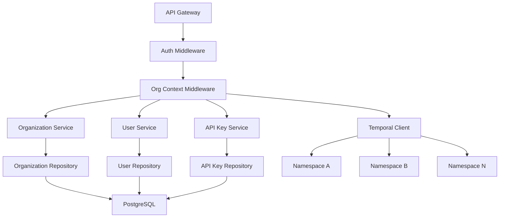

# Multi-Tenant Support with API Key Authentication - Technical Specification

**Document Version**: 1.0  
**Last Updated**: January 15, 2025  
**Author**: Tech Spec Creator Agent  
**Status**: Draft  
**Related PRD**: [Multi-Tenant Support PRD](./_prd.md)

## 1. Executive Summary

This specification outlines the technical implementation for transforming Compozy into a secure, scalable multi-tenant platform. The design provides organization-based isolation using API key authentication, with Temporal namespace segmentation for workflow execution.

**Key Features:**

- Organization-based multi-tenancy with three user roles
- API key authentication for secure access control
- Temporal Cloud namespace isolation per organization
- RESTful APIs and CLI support
- Role-based permissions (SystemAdmin, OrgAdmin, OrgMember)

**Architecture Approach:**

- Clean Architecture with domain-driven design
- Database-level isolation with `org_id` filtering
- Dedicated Temporal namespaces per organization
- Simplified in-memory rate limiting for MVP phase

## 2. System Architecture

### Component Architecture



### Domain Mapping

- **Primary Domain**: `engine/auth` - Authentication middleware, API routes, use cases, organization management, and data access control
- **Related Domains**:
    - `engine/infra/store` - Multi-tenant data access patterns
    - `engine/workflow` - Temporal namespace integration
    - `engine/core` - Organization context types
- **Shared Components**: `pkg/logger` for audit logging, `core.Context` for organization propagation

### Component Responsibilities

| Component            | Responsibility                          | Domain          |
| -------------------- | --------------------------------------- | --------------- |
| OrgService           | CRUD operations, namespace provisioning | engine/auth     |
| UserService          | User lifecycle, role management         | engine/auth     |
| APIKeyService        | Key generation, validation, lifecycle   | engine/auth     |
| AuthMiddleware       | API key authentication                  | engine/auth     |
| OrgContextMiddleware | Organization context injection          | engine/auth     |
| APIRoutes            | API routes                              | engine/auth     |
| UseCases             | Use cases                               | engine/auth     |
| TemporalDispatcher   | Namespace-aware workflow routing        | engine/workflow |

## 3. Technical Design

### 5.1 API Endpoints

All API responses follow the project standard format:

```json
{
    "data": {...},
    "message": "Success description"
}
```

**Organization Management:**

```http
POST /api/v0/organizations
Authorization: Bearer api_key_xxxxx

Request Body:
{
    "name": "Acme Corp",
    "admin_name": "John Doe",
    "admin_email": "john@acme.com"
}

Response: 201 Created
{
    "data": {
        "id": "550e8400-e29b-41d4-a716-446655440000",
        "name": "Acme Corp",
        "temporal_namespace": "org-acme-corp-550e8400",
        "status": "provisioning",
        "created_at": "2024-01-15T10:30:00Z"
    },
    "message": "Organization created successfully"
}
```

```http
GET /api/v0/organizations/{id}
Authorization: Bearer api_key_xxxxx

Response: 200 OK
{
    "data": {
        "id": "550e8400-e29b-41d4-a716-446655440000",
        "name": "Acme Corp",
        "temporal_namespace": "org-acme-corp-550e8400",
        "status": "active",
        "created_at": "2024-01-15T10:30:00Z"
    },
    "message": "Organization retrieved successfully"
}
```

**API Key Management:**

```http
POST /api/v0/organizations/{id}/api-keys
Authorization: Bearer api_key_xxxxx

Request Body:
{
    "name": "Production API Key",
    "role": "org_admin"
}

Response: 201 Created
{
    "data": {
        "id": "660f9500-f39c-42e5-b827-556766550001",
        "name": "Production API Key",
        "key": "cmpz_01234567890abcdef...",
        "role": "org_admin",
        "org_id": "550e8400-e29b-41d4-a716-446655440000",
        "created_at": "2024-01-15T11:00:00Z"
    },
    "message": "API key created successfully"
}
```

### 5.2 Core Services

**Organization Service:**

```go
package organization

import (
    "context"
    "fmt"
    "time"
    "github.com/compozy/compozy/engine/core"
    "github.com/compozy/compozy/engine/infra/store"
)

type Service struct {
    repo            OrgRepository
    temporalService TemporalService
    txManager       store.TransactionManager
    config          *Config
}

func NewService(
    repo OrgRepository,
    temporalService TemporalService,
    txManager store.TransactionManager,
    config *Config,
) *Service {
    if config == nil {
        config = DefaultConfig()
    }
    return &Service{
        repo:            repo,
        temporalService: temporalService,
        txManager:       txManager,
        config:          config,
    }
}

func (s *Service) CreateOrganization(ctx context.Context, req *CreateOrganizationRequest) (*Organization, error) {
    org := &Organization{
        ID:          core.NewID(),
        Name:        req.Name,
        Namespace:   generateNamespace(req.Name),
        Status:      StatusProvisioning,
        CreatedAt:   time.Now().UTC(),
    }

    // Create organization in database with provisioning status
    err := s.txManager.WithTransaction(ctx, func(txCtx context.Context) error {
        return s.repo.Create(txCtx, org)
    })
    if err != nil {
        return nil, fmt.Errorf("failed to create organization: %w", err)
    }

    // Provision Temporal namespace (outside transaction)
    if err := s.temporalService.ProvisionNamespace(ctx, org.Namespace); err != nil {
        // Update status to failed in separate transaction
        s.updateOrganizationStatus(ctx, org.ID, StatusProvisioningFailed)
        return nil, fmt.Errorf("failed to provision Temporal namespace: %w", err)
    }

    // Update status to active
    if err := s.updateOrganizationStatus(ctx, org.ID, StatusActive); err != nil {
        return nil, fmt.Errorf("failed to activate organization: %w", err)
    }

    org.Status = StatusActive
    return org, nil
}

func (s *Service) updateOrganizationStatus(ctx context.Context, id core.ID, status OrganizationStatus) error {
    return s.txManager.WithTransaction(ctx, func(txCtx context.Context) error {
        return s.repo.UpdateStatus(txCtx, id, status)
    })
}
```

**API Key Service:**

```go
package apikey

import (
    "context"
    "crypto/rand"
    "crypto/subtle"
    "encoding/hex"
    "fmt"
    "golang.org/x/crypto/argon2"
    "github.com/compozy/compozy/engine/core"
)

type Service struct {
    repo   APIKeyRepository
    config *Config
}

func NewService(repo APIKeyRepository, config *Config) *Service {
    if config == nil {
        config = DefaultConfig()
    }
    return &Service{
        repo:   repo,
        config: config,
    }
}

func (s *Service) CreateAPIKey(ctx context.Context, req *CreateAPIKeyRequest) (*APIKey, error) {
    keyValue, hash, err := s.generateAPIKey()
    if err != nil {
        return nil, fmt.Errorf("failed to generate API key: %w", err)
    }

    apiKey := &APIKey{
        ID:             core.NewID(),
        Name:           req.Name,
        Hash:           hash,
        Role:           req.Role,
        OrgID: req.OrgID,
        CreatedAt:      time.Now().UTC(),
    }

    if err := s.repo.Create(ctx, apiKey); err != nil {
        return nil, fmt.Errorf("failed to create API key: %w", err)
    }

    // Return the key with the actual value (only time it's exposed)
    apiKey.Key = keyValue
    return apiKey, nil
}

func (s *Service) ValidateAPIKey(ctx context.Context, keyValue string) (*APIKey, *User, *Organization, error) {
    apiKey, err := s.repo.FindByPrefix(ctx, extractPrefix(keyValue))
    if err != nil {
        return nil, nil, nil, fmt.Errorf("invalid API key: %w", err)
    }

    // Constant-time comparison
    if !s.verifyAPIKey(keyValue, apiKey.Hash) {
        return nil, nil, nil, core.NewError(nil, "INVALID_API_KEY", nil)
    }

    user, err := s.repo.GetUser(ctx, apiKey.UserID)
    if err != nil {
        return nil, nil, nil, fmt.Errorf("failed to get user: %w", err)
    }

    org, err := s.repo.GetOrganization(ctx, apiKey.OrgID)
    if err != nil {
        return nil, nil, nil, fmt.Errorf("failed to get organization: %w", err)
    }

    return apiKey, user, org, nil
}

func (s *Service) generateAPIKey() (string, string, error) {
    keyBytes := make([]byte, 32)
    if _, err := rand.Read(keyBytes); err != nil {
        return "", "", err
    }

    keyValue := "cmpz_" + hex.EncodeToString(keyBytes)
    hash := s.hashAPIKey(keyValue)

    return keyValue, hash, nil
}

func (s *Service) hashAPIKey(key string) string {
    salt := make([]byte, 16)
    rand.Read(salt)
    hash := argon2.IDKey([]byte(key), salt, 1, 64*1024, 4, 32)
    return hex.EncodeToString(salt) + ":" + hex.EncodeToString(hash)
}

func (s *Service) verifyAPIKey(key, hash string) bool {
    parts := strings.Split(hash, ":")
    if len(parts) != 2 {
        return false
    }

    salt, _ := hex.DecodeString(parts[0])
    storedHash, _ := hex.DecodeString(parts[1])
    computedHash := argon2.IDKey([]byte(key), salt, 1, 64*1024, 4, 32)

    return subtle.ConstantTimeCompare(storedHash, computedHash) == 1
}
```

**Simplified Rate Limiting Service (MVP Approach):**

```go
package ratelimit

import (
    "context"
    "sync"
    "time"
    "golang.org/x/time/rate"
    "github.com/compozy/compozy/engine/core"
)

// Simplified in-memory rate limiter for MVP/alpha phase
type Service struct {
    mu       sync.RWMutex
    limiters map[string]*rate.Limiter
    config   *Config
}

type Config struct {
    // Requests per second per API key
    RequestsPerSecond int
    // Burst capacity per API key
    BurstCapacity int
    // Cleanup interval for unused limiters
    CleanupInterval time.Duration
}

func DefaultConfig() *Config {
    return &Config{
        RequestsPerSecond: 100,    // 100 requests/second per API key
        BurstCapacity:    20,      // Allow bursts of 20 requests
        CleanupInterval:  time.Hour, // Cleanup unused limiters hourly
    }
}

func NewService(config *Config) *Service {
    if config == nil {
        config = DefaultConfig()
    }

    s := &Service{
        limiters: make(map[string]*rate.Limiter),
        config:   config,
    }

    // Start cleanup goroutine
    go s.cleanupUnusedLimiters()

    return s
}

func (s *Service) CheckRateLimit(ctx context.Context, apiKeyID core.ID) error {
    limiter := s.getLimiter(apiKeyID.String())

    if !limiter.Allow() {
        return core.NewError(nil, "RATE_LIMIT_EXCEEDED", map[string]any{
            "api_key_id": apiKeyID,
            "limit_rps":  s.config.RequestsPerSecond,
        })
    }

    return nil
}

func (s *Service) getLimiter(keyID string) *rate.Limiter {
    s.mu.RLock()
    limiter, exists := s.limiters[keyID]
    s.mu.RUnlock()

    if exists {
        return limiter
    }

    s.mu.Lock()
    defer s.mu.Unlock()

    // Double-check pattern
    if limiter, exists := s.limiters[keyID]; exists {
        return limiter
    }

    // Create new limiter for this API key
    limiter = rate.NewLimiter(
        rate.Limit(s.config.RequestsPerSecond),
        s.config.BurstCapacity,
    )
    s.limiters[keyID] = limiter

    return limiter
}

func (s *Service) cleanupUnusedLimiters() {
    ticker := time.NewTicker(s.config.CleanupInterval)
    defer ticker.Stop()

    for range ticker.C {
        s.mu.Lock()
        // Simple cleanup: remove all limiters
        // In production, this could be more sophisticated
        s.limiters = make(map[string]*rate.Limiter)
        s.mu.Unlock()
    }
}
```

### 5.3 Middleware

**Authentication Middleware:**

```go
package middleware

import (
    "context"
    "strings"
    "github.com/gin-gonic/gin"
    "github.com/compozy/compozy/engine/apikey"
)

type AuthMiddleware struct {
    apiKeyService *apikey.Service
}

func NewAuthMiddleware(apiKeyService *apikey.Service) *AuthMiddleware {
    return &AuthMiddleware{
        apiKeyService: apiKeyService,
    }
}

func (m *AuthMiddleware) RequireAuth() gin.HandlerFunc {
    return func(c *gin.Context) {
        authHeader := c.GetHeader("Authorization")
        if authHeader == "" {
            c.JSON(401, gin.H{
                "error": "Authorization header required",
                "details": "API key must be provided in Authorization header"
            })
            c.Abort()
            return
        }

        // Extract bearer token
        parts := strings.SplitN(authHeader, " ", 2)
        if len(parts) != 2 || parts[0] != "Bearer" {
            c.JSON(401, gin.H{
                "error": "Invalid authorization header format",
                "details": "Use 'Bearer <api_key>'"
            })
            c.Abort()
            return
        }

        apiKeyStr := parts[1]

        // Validate API key and get associated entities
        apiKey, user, org, err := m.apiKeyService.ValidateAPIKey(c.Request.Context(), apiKeyStr)
        if err != nil {
            c.JSON(401, gin.H{
                "error": "Invalid API key",
                "details": "The provided API key is invalid or expired"
            })
            c.Abort()
            return
        }

        // Store all entities in context for downstream handlers
        c.Set("apiKey", apiKey)
        c.Set("user", user)
        c.Set("organization", org)
        c.Set("userRole", apiKey.Role)

        c.Next()
    }
}
```

**Rate Limiting Middleware:**

```go
package middleware

import (
    "github.com/gin-gonic/gin"
    "github.com/compozy/compozy/engine/ratelimit"
    "github.com/compozy/compozy/engine/apikey"
)

type RateLimitMiddleware struct {
    rateLimiter *ratelimit.Service
}

func NewRateLimitMiddleware(rateLimiter *ratelimit.Service) *RateLimitMiddleware {
    return &RateLimitMiddleware{
        rateLimiter: rateLimiter,
    }
}

func (m *RateLimitMiddleware) RateLimit() gin.HandlerFunc {
    return func(c *gin.Context) {
        // Get API key from context (set by AuthMiddleware)
        keyVal, exists := c.Get("apiKey")
        if !exists {
            // No API key in context, skip rate limiting
            c.Next()
            return
        }

        apiKey := keyVal.(*apikey.APIKey)

        // Check rate limit using the actual API Key ID
        if err := m.rateLimiter.CheckRateLimit(c.Request.Context(), apiKey.ID); err != nil {
            c.JSON(429, gin.H{
                "error": "Rate limit exceeded",
                "details": "Too many requests for this API key"
            })
            c.Abort()
            return
        }

        c.Next()
    }
}
```

## 6. Implementation Plan

### Phase 1: Foundation (Week 1-2)

- [ ] Core domain entities (Organization, User, APIKey)
- [ ] Database schema and migrations
- [ ] **Simple in-memory rate limiting service**
- [ ] Basic repository implementations
- [ ] Unit tests for core services

### Phase 2: Authentication & APIs (Week 3-4)

- [ ] API key authentication service
- [ ] Authentication and rate limiting middleware
- [ ] Organization management APIs
- [ ] API key management APIs
- [ ] Integration tests

### Phase 3: Temporal Integration (Week 5-6)

- [ ] Temporal namespace provisioning
- [ ] Namespace-based workflow isolation
- [ ] CLI updates for multi-tenant support
- [ ] End-to-end testing

### Phase 4: Production Readiness (Week 7-8)

- [ ] Audit logging and monitoring
- [ ] Performance optimization
- [ ] **Consider Redis-based rate limiting for scale**
- [ ] Documentation and deployment guides

## 7. Technical Considerations

### Performance

- **Database Indexing**: Composite indexes on (org_id, created_at) for optimal filtering
- **API Key Validation**: < 50ms authentication latency using efficient hash comparison
- **Query Optimization**: All queries include org_id predicate for index usage
- **Connection Pooling**: Organization-aware database connection management

### Security

- **API Key Format**: 32-character random strings with "ck\_" prefix for identification
- **Secure Storage**: Argon2 hashing with salt prevents rainbow table attacks
- **Constant-Time Comparison**: Prevent timing attacks during API key validation
- **Rate Limiting**: Multi-level API protection with organization and key-specific limits
- **Audit Logging**: Track all authentication events and organization operations

### Scalability

- **Temporal Namespace Strategy**: Each organization gets dedicated namespace (compozy-{org-slug})
- **Database Partitioning Ready**: Schema designed for future horizontal partitioning
- **Auto-Scaling Support**: Temporal Cloud supports 100+ namespaces with growth path
- **Connection Efficiency**: Prepared statements and connection pooling

### Error Handling

```go
// Namespace provisioning with exponential backoff retry
func (s *OrgService) provisionTemporalNamespace(ctx context.Context, namespace string) error {
    return retry.Do(func() error {
        return s.temporal.CreateNamespace(ctx, namespace)
    },
        retry.Attempts(3),
        retry.DelayType(retry.BackOffDelay),
        retry.Delay(500*time.Millisecond),
        retry.MaxDelay(5*time.Second),
    )
}

// Consistent error response format
type ErrorResponse struct {
    Error   string `json:"error"`
    Details string `json:"details,omitempty"`
}
```

## 8. Testing Strategy

### Unit Testing

```go
func TestOrgService_Create(t *testing.T) {
    t.Run("Should create organization with namespace", func(t *testing.T) {
        mockRepo := &MockOrgRepository{}
        mockTemporal := &MockTemporalClient{}
        service := NewOrgService(mockRepo, mockTemporal, nil)

        req := &CreateOrganizationRequest{Name: "Test Org"}
        org, err := service.CreateOrganization(context.Background(), req)

        assert.NoError(t, err)
        assert.Equal(t, "Test Org", org.Name)
        assert.Equal(t, "compozy-test-org", org.TemporalNamespace)
        mockTemporal.AssertCalled(t, "CreateNamespace", mock.Anything, "compozy-test-org")
    })
}
```

### Integration Testing

- **Database Isolation**: Verify organization-scoped data access
- **API Key Flow**: End-to-end authentication and authorization
- **Temporal Integration**: Namespace creation and workflow routing
- **Cross-Tenant Security**: Prevent data leakage between organizations

### Test Coverage Goals

- **Service Layer**: 90%+ coverage including error paths
- **Repository Layer**: 85%+ with database integration tests
- **Middleware**: 80%+ focusing on authentication and context handling

## 9. Monitoring & Observability

### Essential Multi-Tenant Metrics

```go
// Organization metrics
func (s *OrgService) RecordMetrics(org *Organization) {
    metrics.Counter("organizations.total").Inc()
    metrics.Gauge("organizations.active").Set(float64(s.getActiveCount()))
}

// API key usage tracking
func (m *AuthMiddleware) TrackAPIKeyUsage(orgID core.ID, userID core.ID) {
    metrics.Counter("api_keys.requests").WithTags(
        "org_id", orgID.String(),
        "user_id", userID.String(),
    ).Inc()
}
```

### Logging Strategy

- **Structured Logging**: Organization and user context in all log entries
- **Security Events**: Failed authentication attempts and suspicious patterns
- **Audit Trail**: Organization creation, user management, and permission changes
- **Performance Monitoring**: API response times and database query performance

### Debugging Support

- **Correlation IDs**: Request tracing across service boundaries
- **Organization Context**: Visible in all error messages and debug logs
- **Health Endpoints**: Organization and namespace status monitoring

## 10. Dependencies

### Internal Dependencies

- `engine/core`: Organization context types and ID generation
- `engine/infra/store`: Database interfaces and connection management
- `engine/workflow`: Temporal client and dispatcher integration
- `pkg/logger`: Structured logging with organization context

### External Dependencies

```go
require (
    github.com/jackc/pgx/v5 v5.5.1                    // PostgreSQL driver
    go.temporal.io/sdk v1.25.1                        // Temporal client
    golang.org/x/crypto v0.28.0                       // Argon2 hashing (security fix)
    github.com/go-playground/validator/v10 v10.16.0   // Input validation
    github.com/gin-gonic/gin v1.9.1                   // HTTP framework
)
```

### Library Integration

- **Argon2**: Secure API key hashing with salt generation
- **Temporal SDK**: Namespace management and workflow isolation
- **pgx**: Connection pooling and prepared statement optimization
- **Validator**: Request validation with custom organization rules

## 11. Migration Strategy

### Development Mode Approach

Since Compozy is in active development/alpha phase, we can modify existing database migrations directly without backwards compatibility concerns:

- **Modify Existing Migrations**: Update current migration files to include `org_id` columns from the start
- **No Data Migration Required**: Development databases can be recreated from scratch
- **Direct Schema Changes**: Add multi-tenant columns and indexes to existing table definitions
- **Clean Migration History**: Maintain a clean migration sequence without ALTER TABLE statements

### Multi-Tenant Schema Integration

```sql
-- Update existing table definitions to include org_id from creation
CREATE TABLE workflows (
    id UUID PRIMARY KEY DEFAULT gen_random_uuid(),
    org_id UUID NOT NULL REFERENCES organizations(id),
    name VARCHAR(255) NOT NULL,
    -- existing columns...
    created_at TIMESTAMP WITH TIME ZONE DEFAULT NOW()
);

-- Create composite indexes for optimal multi-tenant queries
CREATE INDEX idx_workflows_org_created ON workflows(org_id, created_at);
CREATE INDEX idx_tasks_org_created ON tasks(org_id, created_at);
```

### System Organization Setup

```go
// Initialize system organization for admin operations
func InitializeSystemOrganization(ctx context.Context, service *OrgService) error {
    systemOrg := &Organization{
        ID:                core.ParseID("00000000-0000-0000-0000-000000000000"),
        Name:              "system",
        TemporalNamespace: "compozy-system",
        Status:           OrganizationStatusActive,
    }
    return service.CreateSystemOrganization(ctx, systemOrg)
}
```

### Development Flexibility

- **Direct Migration Updates**: Modify existing migration files to include multi-tenant schema from the beginning
- **Database Recreation**: Development and test environments can be fully recreated with new schema
- **No Legacy Support**: Focus on optimal design without backwards compatibility constraints
- **Clean Architecture**: Build multi-tenant support as a core architectural component

## 12. Future Enhancements

### Phase 2 Considerations

- **OAuth2/OIDC Integration**: Enterprise SSO for user authentication
- **Advanced Permissions**: Granular resource-level access control
- **Multi-Organization Users**: Support for users across multiple organizations

### Phase 3 Possibilities

- **Usage Analytics**: Organization-level metrics and billing integration
- **Advanced Rate Limiting**: Per-organization quotas and burst handling
- **Compliance Features**: Audit logging, data retention, and privacy controls

## Technical Review Checklist

Before implementation approval:

- [ ] Aligns with PRD requirements for complete multi-tenant isolation
- [ ] Follows Compozy architectural patterns and SOLID principles
- [ ] Includes comprehensive error handling with exponential backoff
- [ ] Defines clear testing strategy with security validation
- [ ] Addresses performance implications with proper indexing
- [ ] Implements security best practices for API key management
- [ ] Supports monitoring and debugging needs
- [ ] Enables phased implementation with rollback capability
- [ ] Maintains alpha phase flexibility for breaking changes
- [ ] Documents operational requirements and dependencies

## Conclusion

This technical specification provides a comprehensive implementation path for transforming Compozy into a secure, scalable multi-tenant platform. The approach balances security requirements with implementation simplicity, leveraging established patterns while introducing new multi-tenant capabilities. The phased implementation plan enables iterative development with clear validation points and rollback capabilities.
