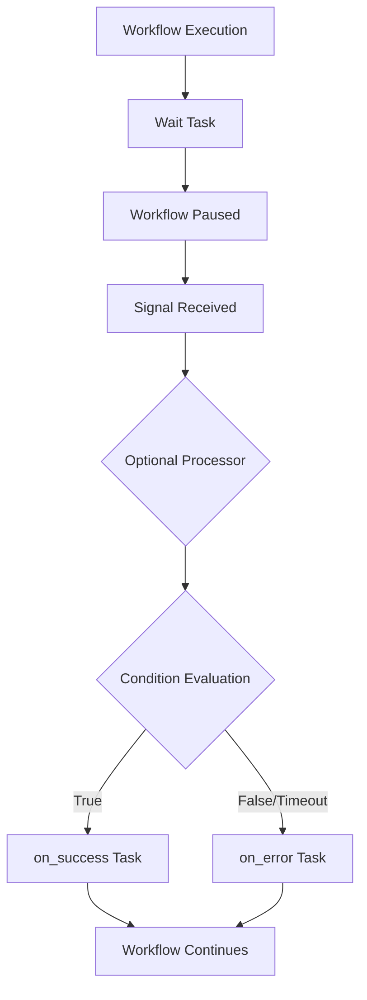

# Wait Task Type - Product Requirements Document

**Document Version**: 2.0  
**Last Updated**: January 19, 2025  
**Author**: PRD Creator Agent  
**Status**: Draft

## 1. Overview

### Executive Summary

The Wait Task Type introduces workflow pause capabilities to Compozy by adding a new `wait` task type that leverages Temporal signals and follows established BaseConfig patterns. This feature enables workflows to pause execution until receiving specific external signals that meet defined conditions, supporting approval workflows, external system integrations, and human-in-the-loop processes.

### Problem Statement

Currently, Compozy workflows execute continuously without the ability to pause and wait for external events. This limitation prevents the implementation of common business scenarios such as approval workflows, integration points with external systems, and processes requiring manual intervention. Business users cannot create workflows that reflect real-world processes where human decisions or external system responses are required to proceed.

### Proposed Solution

Implement a new `wait` task type that integrates seamlessly with Compozy's existing BaseConfig structure and Temporal signal infrastructure. The solution will pause workflow execution until specific signals are received and evaluated against configurable template expressions, then route execution using standard `on_success`/`on_error` patterns.

### Key Benefits

- **Follows Compozy Patterns**: Integrates with existing BaseConfig structure and task configuration standards
- **Leverages Temporal Infrastructure**: Uses proven signal system already in place
- **Standard Routing**: Uses established `on_success`/`on_error` routing patterns
- **Template Expression Support**: Supports flexible condition evaluation using existing template engine

### Visual Context



## 2. Goals & Objectives

### Business Goals

1. **Enable Approval Workflows**: Allow businesses to create workflows requiring human approval at specific stages
2. **Support System Integrations**: Enable workflows to pause while waiting for external system responses
3. **Follow Compozy Standards**: Ensure seamless integration with existing task architecture and patterns

### User Goals

1. **Workflow Designers**: Create wait points using familiar YAML configuration patterns
2. **Business Users**: Execute workflows that require their input or decision-making at specific stages
3. **System Integrators**: Build workflows that coordinate with external systems using standard Compozy patterns

### Success Criteria

- [ ] Wait tasks follow standard BaseConfig structure and patterns
- [ ] Signal conditions are evaluated using template expressions
- [ ] Workflow state accurately reflects paused status
- [ ] Standard routing (`on_success`/`on_error`) handles all outcomes
- [ ] Timeout handling integrates with existing BaseConfig timeout patterns

## 3. User Stories

### Epic: Standard Wait Task Implementation

#### Story 1: Basic Approval Workflow

**As a** workflow designer  
**I want to** create a wait task using standard Compozy patterns  
**So that** I can build approval workflows with familiar YAML configuration

**Acceptance Criteria:**

- [ ] Wait task uses standard BaseConfig fields (`id`, `type`, `timeout`, `on_success`, `on_error`)
- [ ] Signal condition uses template expressions (`{{ .signal.status }}`)
- [ ] Task integrates seamlessly with existing workflow execution
- [ ] Configuration validates using existing task validation patterns

**Example Configuration:**

```yaml
- id: wait-for-approval
  type: wait
  wait_for: "approval_signal"
  condition: '{{ eq .signal.status "approved" }}'
  timeout: "1h"
  on_success:
      next: approval_granted
  on_error:
      next: approval_timeout
```

#### Story 2: Signal Processing with Processor Task

**As a** workflow designer  
**I want to** process signal data before condition evaluation  
**So that** I can transform or validate signal data using existing task patterns

**Acceptance Criteria:**

- [ ] Processor task follows standard task configuration
- [ ] Signal data is available to processor task via template expressions
- [ ] Processor output is available for condition evaluation
- [ ] Processor errors are handled through standard error handling

**Example Configuration:**

```yaml
- id: wait-for-file-upload
  type: wait
  wait_for: "file_upload_signal"
  condition: "{{ eq .processor.output.is_valid true }}"
  processor:
      id: "validate_upload"
      type: "basic"
      $use: tool(local::tools.#(id=="file_validator"))
      with:
          file_data: "{{ .signal.file_content }}"
          file_type: "{{ .signal.content_type }}"
  timeout: "2h"
  on_success:
      next: process_file
  on_error:
      next: invalid_file_handler
```

#### Story 3: External System Integration

**As a** system integrator  
**I want to** wait for external API responses using wait tasks  
**So that** I can coordinate multi-system processes using standard Compozy patterns

**Acceptance Criteria:**

- [ ] Wait task receives signals from external systems
- [ ] Condition evaluation handles API response data
- [ ] Error handling covers timeout and invalid responses
- [ ] Integration follows existing Compozy external service patterns

## 4. Core Features & Requirements

### Feature 1: Wait Task Configuration

**Description**: New `wait` task type that extends BaseConfig with wait-specific properties

**Functional Requirements**:

- FR1.1: Wait task must be added to Type enum as `TaskTypeWait`
- FR1.2: Wait task must include `wait_for` field specifying signal name
- FR1.3: Wait task must support `condition` field with template expressions
- FR1.4: Wait task must support optional `processor` field for signal processing
- FR1.5: Wait task must use standard BaseConfig routing (`on_success`, `on_error`)
- FR1.6: Wait task must use standard BaseConfig timeout handling

**Configuration Structure**:

```go
type WaitTask struct {
    WaitFor   string  `json:"wait_for,omitempty"   yaml:"wait_for,omitempty"   mapstructure:"wait_for,omitempty"`
    Condition string  `json:"condition,omitempty"  yaml:"condition,omitempty"  mapstructure:"condition,omitempty"`
    Processor *Config `json:"processor,omitempty"  yaml:"processor,omitempty"  mapstructure:"processor,omitempty"`
}
```

### Feature 2: Signal Reception and Processing

**Description**: Integration with Temporal signal system using existing infrastructure

**Functional Requirements**:

- FR2.1: Wait task must register signal listeners using existing Temporal patterns
- FR2.2: Signal data must be available in template context as `.signal.*`
- FR2.3: Multiple wait tasks must support different signal names simultaneously
- FR2.4: Signal reception must follow existing error handling patterns
- FR2.5: Signal processing must integrate with workflow state management

### Feature 3: Template-Based Condition Evaluation

**Description**: Condition evaluation using existing template engine with signal context

**Functional Requirements**:

- FR3.1: Condition expressions must use standard template syntax
- FR3.2: Signal data must be accessible via `.signal.field` notation
- FR3.3: Processor output must be accessible via `.processor.output.field` notation
- FR3.4: Condition evaluation must return boolean results
- FR3.5: Condition errors must route to `on_error` transition

**Template Context**:

```
.signal.*              # Raw signal payload data
.processor.output.*    # Processed signal data (if processor defined)
.workflow.*           # Standard workflow context
.tasks.*              # Standard task context
```

### Feature 4: Workflow State Management

**Description**: Integration with existing workflow state tracking during wait periods

**Functional Requirements**:

- FR4.1: Workflow state must reflect "waiting" status during wait task execution
- FR4.2: State must include wait context (task ID, signal name, start time)
- FR4.3: State transitions must use existing workflow state management
- FR4.4: Paused workflows must be queryable through existing state APIs
- FR4.5: State must resume "running" when wait task completes

### Feature 5: Standard Error and Timeout Handling

**Description**: Timeout and error handling using BaseConfig patterns

**Functional Requirements**:

- FR5.1: Timeout must use standard BaseConfig timeout field
- FR5.2: Timeout expiration must route to `on_error` transition
- FR5.3: Processor task failures must route to `on_error` transition
- FR5.4: Condition evaluation errors must route to `on_error` transition
- FR5.5: Error handling must use existing error logging and monitoring

## 5. User Experience

### Configuration Syntax

Wait tasks follow standard Compozy YAML patterns with wait-specific extensions:

**Basic Wait Task:**

```yaml
- id: simple-wait
  type: wait
  wait_for: "user_response"
  condition: "{{ .signal.action }}"
  timeout: "30m"
  on_success:
      next: continue_workflow
  on_error:
      next: handle_timeout
```

**Advanced Wait Task with Processor:**

```yaml
- id: complex-wait
  type: wait
  wait_for: "data_received"
  condition: "{{ and (.processor.output.valid) (gt .processor.output.score 0.8) }}"
  processor:
      id: "data_validator"
      type: "basic"
      $use: tool(local::tools.#(id=="validator_tool"))
      with:
          input_data: "{{ .signal }}"
  timeout: "1h"
  on_success:
      next: process_data
  on_error:
      next: handle_invalid_data
```

### Integration with Existing Patterns

- **Task Validation**: Uses existing task validation framework
- **Template Engine**: Leverages existing template expression evaluation
- **Error Handling**: Follows established error handling patterns
- **State Management**: Integrates with current workflow state tracking

## 6. Technical Constraints

### BaseConfig Integration

- Must extend BaseConfig structure without breaking existing patterns
- Must use standard routing mechanisms (`on_success`, `on_error`)
- Must integrate with existing timeout handling
- Must support existing task validation framework

### Temporal Signal System

- Must use existing Temporal signal infrastructure
- Must not modify current signal handling patterns
- Must support existing signal authentication and security
- Must integrate with current workflow execution engine

### Template Engine Integration

- Must use existing template expression evaluation
- Must support current template syntax and functions
- Must integrate with existing context management
- Must handle template errors through standard patterns

## 7. Out of Scope / Non-Goals

### Explicitly Excluded

- **Custom Routing Patterns**: No custom `on_match`/`on_timeout` routing (use standard patterns)
- **Signal Transformation**: No built-in signal transformation (use processor tasks)
- **Complex Condition Languages**: No custom expression languages (use existing templates)
- **Signal Persistence**: No long-term signal storage beyond workflow execution

### Future Considerations

- **Enhanced Template Functions**: Additional template functions for signal processing
- **Signal Aggregation**: Waiting for multiple signals with aggregation logic
- **Dynamic Signal Names**: Runtime signal name determination
- **Signal Pattern Matching**: Advanced pattern matching for signal content

## 8. Phased Rollout Plan

### Phase 1: MVP (Current)

- **Timeline**: 2-3 weeks
- **Features**:
    - Basic wait task type implementation
    - Simple condition evaluation with template expressions
    - Standard BaseConfig integration (`on_success`, `on_error`, `timeout`)
    - Temporal signal integration
    - Basic workflow state management
- **Success Metrics**:
    - Wait tasks integrate seamlessly with existing task framework
    - Basic approval workflows work end-to-end
    - No regression in existing task functionality

### Phase 2: Enhancement

- **Timeline**: 1-2 weeks after MVP
- **Features**:
    - Processor task functionality
    - Enhanced template context and functions
    - Improved error handling and debugging
    - Additional timeout strategies
- **Dependencies**: MVP must be stable and tested in production scenarios

## 9. Success Metrics

### Quantitative Metrics

| Metric                             | Baseline          | Target | Measurement Method                                  |
| ---------------------------------- | ----------------- | ------ | --------------------------------------------------- |
| Task Configuration Success Rate    | N/A (new feature) | >99%   | Monitor wait task validation success                |
| Signal Processing Latency          | N/A               | <100ms | Track signal receipt to condition evaluation time   |
| Workflow Pause/Resume Success Rate | N/A               | >99%   | Monitor successful workflow continuation after wait |
| Template Evaluation Success Rate   | N/A               | >95%   | Monitor condition evaluation success                |

### Qualitative Metrics

- Developer satisfaction with wait task configuration patterns
- Consistency with existing Compozy task patterns
- Ease of debugging and error diagnosis
- Integration reliability with existing workflows

### MVP Validation Criteria

- [ ] Basic approval workflow with simple condition works end-to-end
- [ ] Wait task configuration validates using existing framework
- [ ] Workflow state accurately reflects paused status
- [ ] Timeout handling works using standard BaseConfig patterns
- [ ] No performance degradation in existing workflow execution

## 10. Risks & Mitigation

### Technical Risks

| Risk                              | Impact | Probability | Mitigation                                        |
| --------------------------------- | ------ | ----------- | ------------------------------------------------- |
| BaseConfig integration complexity | High   | Medium      | Follow existing task type implementation patterns |
| Template context conflicts        | Medium | Low         | Use namespaced context (.signal, .processor)      |
| Workflow state consistency        | High   | Medium      | Use existing state management mechanisms          |
| Signal delivery reliability       | Medium | Low         | Leverage proven Temporal signal infrastructure    |

### Implementation Risks

| Risk                           | Impact | Probability | Mitigation                                   |
| ------------------------------ | ------ | ----------- | -------------------------------------------- |
| Pattern inconsistency          | High   | Medium      | Follow existing task type structures exactly |
| Validation framework conflicts | Medium | Low         | Extend existing validation patterns          |
| Error handling inconsistency   | Medium | Low         | Use standard BaseConfig error handling       |

## 11. Open Questions

### Implementation Details

1. **Processor Task Context**: Should processor task inherit parent context or have isolated context?

    - **Context**: Affects how processor can access workflow variables
    - **Options**: Inherit context, isolated context, or configurable

2. **Signal Data Structure**: Should we enforce JSON schema validation on signal data?
    - **Context**: Affects error handling and template evaluation reliability
    - **Options**: Enforce schema, validate basic structure, or accept any format

### Integration Considerations

1. **Error Context**: How detailed should error context be for condition evaluation failures?

    - **Impact**: Affects debugging and error handling user experience

2. **State Persistence**: Should wait task state persist across workflow engine restarts?
    - **Impact**: Affects reliability and recovery scenarios

## 12. Appendix

### Glossary

- **Wait Task**: A task type that pauses workflow execution until a signal is received and conditions are met
- **Signal**: An external event sent to a workflow via Temporal's signal mechanism
- **Processor**: An optional embedded task that processes signal data before condition evaluation
- **Template Expression**: A condition using Compozy's template engine syntax

### Configuration Examples

**Minimal Wait Task:**

```yaml
- id: basic-wait
  type: wait
  wait_for: "continue_signal"
  on_success:
      next: next_task
```

**Complete Wait Task:**

```yaml
- id: complete-wait
  type: wait
  wait_for: "approval_signal"
  condition: '{{ and (eq .signal.status "approved") (.processor.output.authorized) }}'
  processor:
      id: "auth_check"
      type: "basic"
      $use: tool(local::tools.#(id=="auth_validator"))
      with:
          user_id: "{{ .signal.user_id }}"
          resource: "{{ .signal.resource }}"
  timeout: "24h"
  on_success:
      next: approved_action
  on_error:
      next: denied_action
```

### References

- Existing BaseConfig structure and patterns
- Current task type implementations (Router, Signal, etc.)
- Temporal signal handling patterns in codebase
- Template engine expression syntax and functions

### Assumptions from Requirements Gathering

- BaseConfig patterns are sufficient for wait task needs
- Existing template engine can handle signal and processor context
- Current Temporal signal infrastructure supports wait requirements
- Standard error handling patterns are adequate for wait scenarios
- Existing workflow state management can track wait status

### Change Log

| Date             | Version | Changes                                     | Author      |
| ---------------- | ------- | ------------------------------------------- | ----------- |
| January 19, 2025 | 1.0     | Initial creation                            | PRD Creator |
| January 19, 2025 | 2.0     | Complete rewrite to follow Compozy patterns | PRD Creator |
