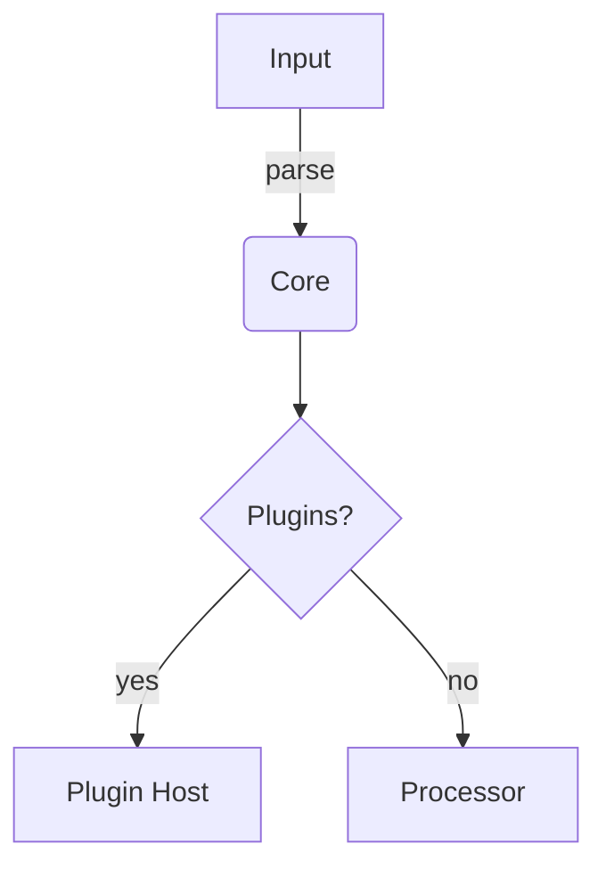

# `your-package-name` – _One-line elevator pitch_

[](https://github.com/ORG/REPO/actions/workflows/ci.yml)
[](https://codecov.io/gh/ORG/REPO)
[](https://www.npmjs.com/package/your-package-name) <!-- swap for crates.io / PyPI / Docker Hub, if needed -->
[](./LICENSE)
[](https://ORG.github.io/REPO) <!-- remove if not publishing docs -->

> **Elevator pitch (1–2 lines):** What problem does this sub-package solve and why should anyone care?

---

## Table of Contents

- [`your-package-name` – _One-line elevator pitch_](#your-package-name--one-line-elevator-pitch)
  - [Table of Contents](#tableofcontents)
  - [Overview](#overview)
  - [Motivation](#motivation)
  - [Design Highlights](#designhighlights)
  - [Getting Started](#gettingstarted)
  - [Installation (if aplicable)](#installation-if-aplicable)
  - [Usage](#usage)
    - [Library](#library)
    - [(Optional) CLI _(if applicable)_](#optionalcli-if-applicable)
  - [Configuration _(if applicable)_](#configuration-if-applicable)
  - [Extensibility _(if applicable)_](#extensibility-if-applicable)
  - [Examples _(if applicable)_](#examples-if-applicable)
  - [API Reference _(if applicable)_](#apireference-if-applicable)
  - [Internals \& Architecture _(if applicable)_](#internalsarchitecture-if-applicable)
  - [Testing _(if applicable)_](#testing-if-applicable)
  - [Release \& Versioning](#releaseversioning)
  - [Contributing](#contributing)
  - [License](#license)

---

## Overview

Provide a short, high‑level description of **what** this package does in the ecosystem and **where** it fits in the larger project.

```text
┌────────────┐   uses   ┌────────────┐
│  upstream  │ ───────▶ │ <subpackage>│
└────────────┘          └────────────┘
                         ▲
                         │
                         ▼
                    consumers
```

---

## Motivation

Explain **why** this sub‑package exists. 2‑4 bullet points are usually enough.

- Reduce X boilerplate
- Provide Y guarantees (e.g. type‑safety, performance)
- Encapsulate Z concern behind a stable API

---

## Design Highlights

- **Modular core** — pure functions + thin adapters
- **Stateless by default** — explicitly opt‑in to stateful helpers
- **Extensible** — plug‑in system via trait/TS‑interface _(see _[**_Extensibility_**](#extensibility-if-applicable)_)_
- **Zero heavy dependencies** _(< 200 kB)_

---

## Getting Started

```bash
# 1. Add dependency
$ <pkg‑manager> add <subpackage>

# 2. Start coding
$ editor ./src/your_file.rs  # or .ts/.py …
```

> **Tip:** skim the [Examples](#examples-if-applicable) first if you learn best by copy‑pasting.

---

## Installation (if aplicable)

| Ecosystem                    | Command                              |
| ---------------------------- | ------------------------------------ |
| **Cargo**                    | `cargo add <subpackage>`             |
| **npm**                      | `npm i <subpackage>`                 |
| **pip**                      | `pip install <subpackage>`           |
| **Binary** (pre‑built tools) | Grab from [Releases](../../releases) |

---

## Usage

### Library

```rust
use <subpackage>::Foo;

let foo = Foo::new();
foo.do_the_thing()?;
```

> Available APIs are fully documented in [API Reference](#api-reference-if-applicable).

### (Optional) CLI _(if applicable)_

If you enabled the `cli` feature flag:

```bash
$ < pkg > --help
```

- Runs standalone or next to your application
- Mirrors the library’s capabilities under the hood

---

## Configuration _(if applicable)_

```toml
# example.config.toml
log_level = "info"
cache_dir = "~/.cache/<subpackage>"
```

| Key         | Type     | Default | Purpose                      |
| ----------- | -------- | ------- | ---------------------------- |
| `log_level` | `string` | `info`  | Controls verbosity           |
| `cache_dir` | `path`   | OS tmp  | Where to store intermediates |

Environment overrides (`ALL_CAPS`) are respected.

---

## Extensibility _(if applicable)_

Implement the `Plugin` trait / TypeScript interface:

```rust
// src/plugin.rs
pub trait Plugin {
    fn id(&self) -> &str;
    fn run(&self, input: Data) -> Result<Data>;
}
```

Drop dynamic libraries in `$SUBPACKAGE_HOME/plugins` or register at runtime.

---

## Examples _(if applicable)_

| Scenario      | Snippet                                |
| ------------- | -------------------------------------- |
| Minimal       | `Foo::default().run()?`                |
| Custom config | `Foo::from_path("config.toml").run()?` |
| Async stream  | `Foo::stream(input).await`             |

More in [`examples/`](./examples).

---

## API Reference _(if applicable)_

Auto‑generated docs live at **\<docs‑link>**. For quick lookup:

- [`Foo`](https://docs.rs/<subpackage>/Foo) — main orchestrator
- [`Bar`](https://docs.rs/<subpackage>/Bar) — helper util

---

## Internals & Architecture _(if applicable)_



- **Core** is pure & deterministic
- **Plugin Host** provides isolation and hot‑reload

---

## Testing _(if applicable)_

```bash
$ < pkg‑manager > test       # unit + integration
$ < pkg‑manager > test --doc # doctests (if supported)
```

- 100 % safe code (run `cargo geiger` / `npm audit`)
- Mutation tests via `cargo mutagen` _(optional)_

---

## Release & Versioning

Follows **Semantic Versioning 2.0**. Changelog managed by **Conventional Commits**.

```bash
git commit -m "feat(api)!: breaking‑change description"
```

---

## Contributing

We ♥ contributions! Please read [CONTRIBUTING.md](./CONTRIBUTING.md) and open a draft PR early.

1. Fork → feature branch → PR
2. `make prepush` passes (fmt + lint + test)
3. Wait for review & CI

---

## License

Distributed under the MIT License. See [`LICENSE`](./LICENSE) for full text.
